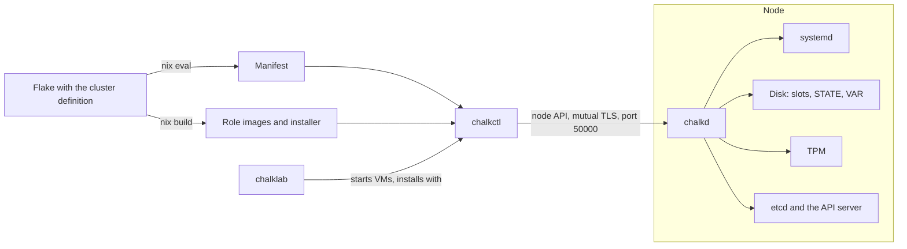
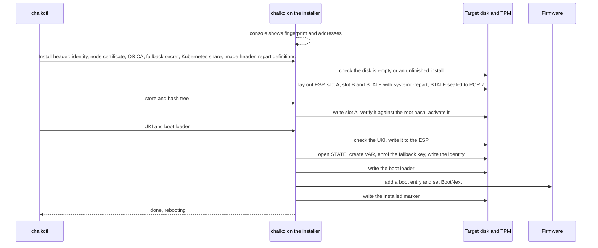

# Architecture

chalkos turns a cluster declared in Nix into machines that boot a signed, read-only image and
are managed through one agent. This page names the parts, says where each one runs and follows
a node from its first boot to its first upgrade.

The parts fall into three places:

- On the operator's machine, a [flake](../reference/glossary.md#flake) holds the
  [cluster definition](../reference/glossary.md#cluster-definition). Nix evaluates it into role
  images, an [installer](../reference/glossary.md#installer) and a
  [manifest](../reference/glossary.md#manifest).
- Also on the operator's machine, [chalkctl](../reference/glossary.md#chalkctl) reads the
  manifest, builds and signs images and drives the nodes.
  [chalklab](../reference/glossary.md#chalklab) runs a whole cluster as local virtual machines.
- On every node, [chalkd](../reference/glossary.md#chalkd) serves the node API, installs and
  upgrades the node, applies its configuration and runs the Kubernetes control plane.

The diagram shows how they connect.



## What does Nix build?

Nix builds everything that is the same on every node of a [role](../reference/glossary.md#role):
the operating system, Kubernetes and chalkd. `chalkos.lib.mkCluster` evaluates the cluster
definition in two layers.

The first layer is the cluster itself: the options under `chalkos.*` that declare the cluster's
settings, its roles, its [platforms](../reference/glossary.md#platform) and its
[nodes](../reference/glossary.md#node). This layer produces the manifest, a JSON document with
the cluster's settings, the attribute path of every role's images and each node's
[identity](../reference/glossary.md#identity).

The second layer is one NixOS system per role and platform. Each is built from chalkos's node
modules, the cluster's settings as read-only options, the platform's modules and the role's own
modules, and becomes one unsigned raw disk [image](../reference/glossary.md#image). The second
layer cannot see the nodes: `config.chalkos.nodes` throws inside a role image, because one image
serves every node of the role on that platform. The installer is a second-layer system too, built
from the node modules and the cluster's settings, and belongs to no role or platform.
[The cluster definition](cluster-definition.md) explains both layers.

What Nix decides at build time and what reaches a node at runtime:

| Decided at build time, in the image | Delivered at runtime, in the identity |
| --- | --- |
| Kernel, kernel modules and initrd | Hostname |
| NixOS services and the role's modules | systemd-networkd units |
| Kubernetes version and the control plane's flags | Kubernetes node name, addresses, labels and taints |
| Cluster name, endpoint and the [OS CA](../reference/glossary.md#os-ca) for maintenance mode | Storage: system disk, VAR, volumes and encryption |
| Partition sizes of the system region | Time servers |
| Boot tries and health timeout | Values of [extensions](../reference/glossary.md#extension) |

The split keeps one image per role and platform, so a cluster of fifty workers builds and signs
one worker image. A change in the left column is an [upgrade](upgrades.md); a change in the right
column is delivered with [`chalkctl apply-identity`](../reference/cli/chalkctl_apply-identity.md)
and needs no reboot.

## What runs on the operator's machine?

chalkctl reads the cluster from the flake with `nix eval` of `chalkos.<cluster>.manifest`, or from
a file with `--manifest`. It is the only inventory chalkctl has: node names, roles, platforms and
addresses all come from the cluster definition. When a command needs an image, chalkctl builds
it with `nix build` of `chalkos.<cluster>.roles.<role>.images.<platform>`, or takes one given with
`--image`.

chalkctl authenticates in one of two ways:

- With the [secrets file](../reference/glossary.md#secrets-file), which holds every CA key of the
  cluster. chalkctl signs itself a short-lived admin certificate from it for each run. Installs,
  identity changes and rotations need it.
- With a [client file](../reference/glossary.md#client-file), which holds one certificate of the
  [reader](../reference/glossary.md#reader), [operator](../reference/glossary.md#operator) or
  [admin](../reference/glossary.md#admin) role. Upgrades, reboots, status and logs work with one,
  so the people who operate a cluster need not hold its CA keys.

chalklab runs a cluster's `kvm` nodes as QEMU virtual machines on one machine, each with
[Secure Boot](../reference/glossary.md#secure-boot) and a [TPM](../reference/glossary.md#tpm).
It builds the images, enrols its own lab keys in the VMs' firmware, signs the images with them,
boots each node and installs it with chalkctl. A
[lab](../reference/glossary.md#lab) is how the [quick start](../getting-started/index.md) runs.

## What runs on a node?

A node runs its role image from a read-only store checked by
[dm-verity](../reference/glossary.md#dm-verity), with its root file system in memory. What it
writes goes to two encrypted partitions:
[STATE](../reference/glossary.md#state), 128 MiB by default, which holds the node's identity,
certificates and Kubernetes secrets, and [VAR](../reference/glossary.md#var), mounted at `/var`,
which holds etcd, containerd, the kubelet and logs. [The image](image.md) describes the disk;
[Storage and encryption](storage.md) describes STATE and VAR.

These units do chalkos's work at every boot:

| Unit | When | What it does |
| --- | --- | --- |
| `chalkos-state.service` | initrd | Unlocks and mounts STATE, with the TPM or with the second key the console asks for |
| `chalkos-storage.service` | initrd | Creates the volumes recorded on STATE and mounts VAR |
| `chalkos-identity.service` | before networkd | Applies the identity on STATE: hostname, network units, time servers, `/run/chalkos/node.json` |
| `chalkd.service` | after the network | Serves the node API and carries out its requests |
| `chalkos-kubernetes.service` | on Kubernetes roles, once the network is online | Waits for the node's addresses and prepares its Kubernetes certificates, kubeconfigs and kubelet flags |
| `chalkos-health.service` | only on a boot that systemd-boot counts | Decides whether a new image is healthy |

chalkd runs as root with its capabilities, because it partitions disks, enrols TPM keyslots,
writes EFI variables, mounts volumes the host must see and sets the hostname. Its unit therefore
has no file system or hostname namespace. The sandboxing it does have restricts it to the socket
families it uses (Unix, IPv4, IPv6, netlink, the kernel crypto API and packet sockets), forbids
new privileges, fixes the system call architecture and protects the clock. chalkd restarts
whenever it stops, with no limit, because it is the only way to reach the node: nodes have no SSH
and no login.

On a [control plane](../reference/glossary.md#control-plane), chalkd also renders the static pods
of etcd, the API server, the controller manager and the scheduler, holds the
[VIP](../reference/glossary.md#vip) when elected, renews the node certificates of the cluster and
drains nodes for upgrades. [Kubernetes on chalkos](kubernetes.md) covers that side.

## Which mode is chalkd in?

chalkd runs in one of two modes, and the file `installed` on STATE decides which.

In [maintenance mode](../reference/glossary.md#maintenance-mode), on a node that is not
installed, chalkd serves a self-signed certificate and prints its SHA-256 fingerprint and the
node's addresses on the console:

```text
maintenance mode, accepting clients of the OS CA; certificate fingerprint <fingerprint>
addresses <addresses>; certificate fingerprint <fingerprint>
```

It accepts only reads (node information, disks and logs), a reboot and an install. An image built
with [`chalkos.cluster.osCA`](../reference/options.md#chalkosclusterosca) carries the cluster's
OS CA and accepts only clients with a certificate from it. An image built without one prints
`accepting any client` and accepts anyone until it is installed.

In [normal mode](../reference/glossary.md#normal-mode), on an installed node, chalkd serves its
[node certificate](../reference/glossary.md#node-certificate) and accepts only clients whose
certificate chains to the OS CAs on STATE. Each method is open to the
[client roles](../reference/glossary.md#client-role) allowed to call it, and the install method
is closed.

When chalkd cannot read STATE well enough to tell whether the node is installed, it fails and
restarts. It never falls back to maintenance mode, which would offer an installed node for a
new install.

## How do chalkctl and chalkd talk?

They use the [node API](../reference/api.md): Connect RPC over HTTPS with TLS 1.3 on TCP port
50000, with a client certificate on every call. chalkd reads the client's role from its
certificate's Organization and checks it for every request against the OS CAs it trusts at that
moment, so a client whose CA was rotated out loses access on its next request, not when its
connection closes. [Security model](security.md) explains the roles and what each may call.

## How does a machine become a node?

A node's life has five stages: a first boot into maintenance mode, the install, the first boot in
normal mode, joining Kubernetes and upgrades.

### First boot into maintenance mode

A machine reaches maintenance mode in one of two ways:

- It boots the installer, from a USB disk, an ISO or a network boot. The installer never touches
  the medium it boots from; it writes a role image to another disk.
- It boots its role image directly, written to its disk with `dd`, used as a VM's disk or created
  by chalklab. On the first boot, systemd-repart adds [slot](../reference/glossary.md#slot) B
  and an empty STATE behind the partitions the image ships with. STATE has no `installed` file,
  so chalkd starts in maintenance mode.

### The install

[`chalkctl install`](../reference/cli/chalkctl_install.md) connects to the node, compares its
certificate with the fingerprint from the console, and sends what makes the machine this node:

```sh
chalkctl install <node> --fingerprint=<fingerprint>
```

`<node>` is the node's name in the cluster definition and `<fingerprint>` the one on its
console. `--insecure` accepts any certificate instead and prints the fingerprint chalkctl saw, to
compare with the console afterwards. Either way, the secrets travel over a second connection
pinned to that fingerprint.

On a node that runs its role image, the install happens in place: chalkctl sends no image. chalkd
recreates STATE if its encryption differs from the node's storage settings, opens it, creates VAR
and the volumes, enrols the second keyslot of every encrypted volume, writes the identity and
certificates, gives the [ESP](../reference/glossary.md#esp) a random partition UUID and writes
the `installed` marker.

On a node that runs the installer, chalkctl also sends the role image of the node's platform, in
the same parts an upgrade sends, plus the boot loader. The sequence shows what the installer does
with them.



Before anything is written, the installer checks that the image belongs to the identity's cluster,
role and platform and to the machine's architecture. With Secure Boot enforced, it also checks the
UKI's and the boot loader's signatures against the firmware's
[db and dbx](../reference/glossary.md#db-and-dbx), as the firmware will at the next boot. The
installer takes a disk on which blkid finds no signature, or one holding an unfinished install of
the node's role, which it continues; any other disk only with `--wipe-disk`. Until the boot loader
is written the firmware finds nothing to boot on the target, so an interrupted install never
boots a half-installed node, and running the same command again continues it.

The image travels as its parts: the compressed store, its hash tree, the UKI and systemd-boot,
about 300 MiB for a Kubernetes role, instead of the multi-gigabyte raw image.

### First boot in normal mode

The node reboots into its role image. The initrd unseals STATE and VAR with the TPM,
`chalkos-identity.service` applies the identity, and chalkd finds the `installed` marker and
starts in normal mode with the node certificate from STATE.

### Joining Kubernetes

The first control plane waits for [`chalkctl bootstrap`](../reference/cli/chalkctl_bootstrap.md),
which starts etcd as its first member and the control plane with it; the
[bootstrap](../reference/glossary.md#bootstrap) runs once per cluster. Further control planes
join the existing etcd on their own, and workers join the API server with the kubelet certificate
chalkctl issued them at install. [Kubernetes on chalkos](kubernetes.md) describes the joins.

### Upgrades

An upgrade replaces the whole image at once.
[`chalkctl upgrade`](../reference/cli/chalkctl_upgrade.md) sends each node the new image, chalkd
writes it into the inactive slot, and the node boots it with
[boot counting](../reference/glossary.md#boot-counting). If the new image does not become
healthy within its tries, the node falls back to the image it ran before.
[Upgrades](upgrades.md) and [Boot, health and rollback](boot-and-rollback.md) explain both halves.

## Limits

- chalkos does not enrol Secure Boot keys on nodes. The firmware must trust the signer of the
  images before the install; only chalklab enrols keys, its own, in its VMs. The options
  `chalkos.secureBoot.enrollment` and `chalkos.secureBoot.require` are declared, but nothing reads
  them yet.
- Images reach nodes only through chalkctl's stream over the node API. There is no pull from a
  registry and no update server.
- Nodes have no shell access. Debugging goes through the node API's logs and status, or a
  privileged pod with [`chalkos.debug.tools`](../reference/options.md#chalkosdebugtools).
- An image without an OS CA accepts any client in maintenance mode. Build images with
  `chalkos.cluster.osCA` set for machines on a network others can reach.

## Related pages

- [The cluster definition](cluster-definition.md) and [The image](image.md) for the Nix side.
- [Security model](security.md) for the client roles and what Secure Boot and the TPM protect.
- [Install on bare metal](../guides/install-bare-metal.md) for the install as a task.
- [`chalkctl install`](../reference/cli/chalkctl_install.md) and the [node API](../reference/api.md)
  for the details.
- [Architecture for developers](../contributing/architecture.md) for the code's layout.
