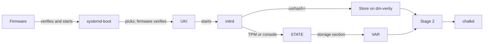
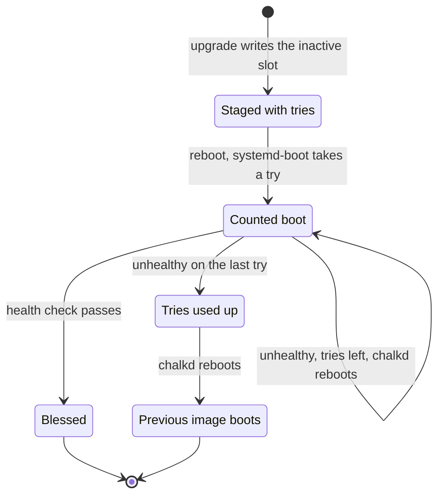

# Boot, health and rollback

A node boots a chain of signed and hashed parts, from the firmware to
[chalkd](../reference/glossary.md#chalkd), and each part checks the next. After an
[upgrade](../reference/glossary.md#upgrade), the boot loader gives the new
[image](../reference/glossary.md#image) a fixed number of tries, chalkd decides whether each try
is healthy and a new image that never becomes healthy is replaced by the one the node ran
before. So a bad image leaves a node running its previous image after a few reboots, instead of
a node that does not come back.

## How does a node boot?

The boot chain runs from the firmware through systemd-boot and the
[UKI](../reference/glossary.md#uki) to the initrd, which opens the store and the node's
partitions before the system starts.



1. The UEFI firmware starts systemd-boot from the [ESP](../reference/glossary.md#esp). With
   [Secure Boot](../reference/glossary.md#secure-boot) on, it first checks systemd-boot's
   signature against [db and dbx](../reference/glossary.md#db-and-dbx).
2. systemd-boot picks a UKI and asks the firmware to start it, which checks the UKI's signature
   the same way.
3. The UKI's stub starts the kernel with the initrd and command line the UKI carries, so both are
   covered by its signature.
4. The initrd opens the store and the node's partitions, as a later section describes.
5. Stage 2 applies the node's identity, starts the network and starts chalkd.

## How does systemd-boot choose an entry?

systemd-boot lists the UKIs in `/EFI/Linux` on the ESP. It sorts the entries of one image ID by
version, newest first, and boots the first whose tries are not used up. When the EFI variable
`LoaderEntryPreferred` names an entry that is not used up, it boots that one instead. Every
upgrade sets the variable to its new entry, so a downgrade to an older version boots too, and
systemd-boot passes over the preferred entry once its tries are used up.

An entry with a tries counter in its name is being counted;
[boot counting](#how-does-boot-counting-work) explains the counter.

## What happens in the initrd?

The initrd prepares the root file system in four steps.

- systemd-repart compares the boot disk with the image's partition definitions. On the first boot
  of a role image it adds [slot](../reference/glossary.md#slot) B and an empty STATE; on later
  boots everything is there and it changes nothing. It runs only on the disk systemd-boot was
  loaded from, which udev marks, so a second disk with the same image is never touched.
- The kernel command line's `usrhash=` names the [store](../reference/glossary.md#store)'s
  [root hash](../reference/glossary.md#root-hash). systemd finds the data and hash partitions
  whose UUIDs derive from it, opens them with [dm-verity](../reference/glossary.md#dm-verity) and
  mounts the store read-only.
- `chalkos-state.service` unlocks [STATE](../reference/glossary.md#state) and mounts it. The
  [TPM](../reference/glossary.md#tpm) unseals its key when [PCR 7](../reference/glossary.md#pcr-7)
  holds the value it was sealed to, which is the case after an upgrade signed by the same key.
  When the TPM refuses, systemd-cryptsetup asks on the console for the second key: the node's
  [recovery key](../reference/glossary.md#recovery-key) or a password, as the node's storage
  settings chose.
- `chalkos-storage.service` reads the storage section recorded on STATE, creates any volume that
  is missing, and unlocks and mounts [VAR](../reference/glossary.md#var) the same way. A node that
  is not installed has no storage section, so `/var` stays in memory.

[Storage and encryption](storage.md) explains the keys and volumes.

## What happens after the initrd?

Stage 2 starts the node's own services in order:

1. `chalkos-identity.service` applies the [identity](../reference/glossary.md#identity) on STATE
   before networkd starts: hostname, network units, time servers and the values services read.
2. systemd-networkd brings up the network.
3. chalkd starts. It finds the `installed` marker on STATE and serves in
   [normal mode](../reference/glossary.md#normal-mode), or finds none and serves in
   [maintenance mode](../reference/glossary.md#maintenance-mode).
4. On a Kubernetes role, `chalkos-kubernetes.service` waits for the node's addresses and prepares
   its certificates and configuration, and containerd and the kubelet follow.
5. On a boot that systemd-boot counts, `chalkos-health.service` decides whether the boot is
   healthy.

## How does boot counting work?

An upgrade installs the new UKI as `chalkos_<version>+<tries>.efi`, where `<tries>` is the new
image's [`chalkos.upgrade.bootTries`](../reference/options.md#chalkosupgradeboottries), 3 by
default. The number travels in the image's os-release as `CHALKOS_BOOT_TRIES`, so the image being
installed sets it, not the one running.

Before each boot of the entry, systemd-boot renames the file to count the try: `+3` becomes
`+2-1`, then `+1-2`, then `+0-3`. Once the system decides the boot is good,
`systemd-bless-boot.service` renames the file to `chalkos_<version>.efi`, without a counter, and
the entry is a normal, [blessed](../reference/glossary.md#blessed-boot) entry from then on. An
entry at `+0` is used up, and systemd-boot skips it.

The diagram shows the states of a new image's entry.



The previous image's entry stays on the ESP throughout, and its slot is untouched, so the
fallback boots exactly what the node ran before.

## When is a boot healthy?

`chalkos-health.service` runs `chalkd health` on every boot that systemd-boot counts, and only
then, because only `systemd-bless-boot.service` pulls in `boot-complete.target`, which the health
unit is required by. It checks every 5 seconds until the node is healthy or
[`chalkos.upgrade.healthTimeout`](../reference/options.md#chalkosupgradehealthtimeout) passes,
300 seconds by default.

Every check starts with chalkd: it must complete a TLS handshake with the node's own certificate
on port 50000, because a node chalkd cannot serve cannot be managed and must fall back. The rest
of the [health check](../reference/glossary.md#health-check) depends on the node's part in
Kubernetes:

| Node | Healthy when |
| --- | --- |
| [Control plane](../reference/glossary.md#control-plane) that is an [etcd member](../reference/glossary.md#etcd-member) | its local etcd member answers, its API server is ready and its kubelet's `/healthz` answers |
| [Worker](../reference/glossary.md#worker) | its kubelet's `/healthz` answers and its Node is registered |
| Node without Kubernetes, or not yet part of a cluster | its identity was applied and no unit of the boot failed |

A Kubernetes node whose preparation failed is unhealthy. "No unit failed" counts the units that
`multi-user.target` and `sysinit.target` pull in; jobs that timers and sockets start do not count,
nor the units listed in
[`chalkos.upgrade.healthIgnoreUnits`](../reference/options.md#chalkosupgradehealthignoreunits).

When the check passes, the unit succeeds, `boot-complete.target` is reached and
`systemd-bless-boot` blesses the entry. A blessed image is never rolled back.

## What happens when a boot is not healthy?

When the timeout passes, chalkd does two things.

It records the failure: the last 30 journal lines of chalkd and the health check during this
boot, headed by the version and root hash of the store that booted, in
`/var/lib/chalkd/failed-boot` on VAR. The record lives on VAR because the image the node falls
back to must read it; the journal cannot serve, as the read-only image gets a new machine ID at
every boot and keeps each boot's journal apart.

Then it reboots the node, but only when a reboot leads systemd-boot on: to another try while the
entry has tries left, or, on the last try, to an entry the node can fall back to. Rebooting a boot
that is not counted, or a used-up entry booted because nothing else is left, would boot the same
image again in a loop, so chalkd leaves such a node running and logs why. A health check that
ends before it decides, stopped by its unit's timeout or crashed, is handled the same way.

After the last try, systemd-boot skips the used-up entry and boots the previous image, whose
slot and UKI the upgrade never touched. Its entry carries no counter, so its boot is not counted
and no health check runs.

## How does a node report a rollback?

chalkd reads the boot from the ESP whenever it reports status: the entry it booted, whether that
boot was blessed, an entry of the image with tries left that boots next and an entry with its
tries used up that it fell back from. [`chalkctl status`](../reference/cli/chalkctl_status.md)
prints those as its first lines. After a [rollback](../reference/glossary.md#rollback) they read:

```text
image <version>, booted from chalkos_<version>.efi
upgrade to <new-version> failed: rolled back to <version>
  <the failed boot's last journal lines>
```

A boot that is still counted adds `, not found healthy yet` to the first line, and an upgrade
installed with `--no-reboot` shows as `upgrade to <new-version> installed; it boots next`. The
used-up UKI stays on the ESP until the next upgrade removes it, and the record on VAR is removed
once a counted boot is found healthy. [`chalkctl upgrade`](../reference/cli/chalkctl_upgrade.md)
stops at a node that rolled back, as [Upgrades](upgrades.md) describes.

## What can the health check not decide?

The health check runs late in the boot, after chalkd starts. A counted boot that hangs before
then is never decided by it: for example at the initrd's console prompt for a disk's second key,
or in `chalkos-identity.service`. The node stays in that boot until someone resets it. Only then
does systemd-boot take the next try, or fall back once the tries are used up. A BMC's power reset,
or a hypervisor's, is enough.

The check also judges only what it checks. A new image whose workloads fail while etcd, the API
server and the kubelet are healthy is blessed.

## What happens when a boot fails?

| Situation | What happens |
| --- | --- |
| The TPM does not unseal STATE, for example after Secure Boot was turned off or db changed | The console asks for the recovery key or password. The node never drops to maintenance mode, which would let someone at the console install it anew |
| STATE holds no `installed` marker, as on a first boot | chalkd starts in maintenance mode and waits for an install |
| chalkd cannot read STATE to tell whether the node is installed | chalkd fails and restarts; it does not fall back to maintenance mode |
| A new image does not become healthy within its tries | The node falls back to the previous image and reports the rollback in status |
| A counted boot hangs before the health check | The node stays in that boot until it is reset |
| A blessed image fails at a later boot | Nothing rolls back: the health check does not run. Status lists the failed units |

[Recover a node](../guides/recover-node.md) and [Troubleshooting](../guides/troubleshooting.md)
cover the fixes.

## Limits

- Rollback protects the first boots of a new image only. Once blessed, an image stays, even if it
  fails later.
- The health check covers chalkd, etcd, the API server and the kubelet, not workloads. A
  regression that only applications notice is blessed.
- A hang before the health check, such as a console prompt, needs a reset from outside: the node
  cannot reboot itself from there.
- Each try lasts up to the health timeout plus a reboot, so with the defaults a bad image runs
  for about 15 minutes before the node is back on its previous image.
- systemd-boot itself is never updated or rolled back by an upgrade.

## Related pages

- [The image](image.md) for the UKI, the store and the slots.
- [Upgrades](upgrades.md) for how a new image is installed and rolled through a cluster.
- [Storage and encryption](storage.md) for STATE, VAR and their keys.
- [Security model](security.md) for what Secure Boot and PCR 7 protect.
- [Upgrade a cluster](../guides/upgrade-cluster.md#if-a-node-rolls-back) for what to do after a
  rollback.
- [Recover a node](../guides/recover-node.md) and [Troubleshooting](../guides/troubleshooting.md).
