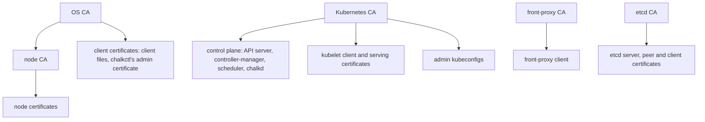

# Certificates

A chalkos cluster runs on five certificate authorities and two keys, all generated once by
[`chalkctl gen secrets`](../reference/cli/chalkctl_gen_secrets.md) and kept in the
[secrets file](../reference/glossary.md#secrets-file). Two CAs authenticate the node API that
[chalkd](../reference/glossary.md#chalkd) serves; three authenticate Kubernetes. This page lists
what each one issues, how long each certificate lives, what renews it, and how a CA or key is
replaced. The secrets file also holds the recovery secret, from which each node's
[recovery key](../reference/glossary.md#recovery-key) is derived. The [Security model](security.md)
explains who is allowed what with these certificates.

## Which CAs and keys does a cluster have?

Every CA has an ECDSA P-256 key, and every certificate chalkos issues is capped at its CA's own
expiry and backdated by an hour, so a node whose clock lags slightly still accepts it.

| CA or key | Lifetime | Issues or does | Held by |
| --- | --- | --- | --- |
| [OS CA](../reference/glossary.md#os-ca) | 10 years | Client certificates and the node CA; path length 1 | The secrets file; its certificate is on every installed node, and in every image built with [`chalkos.cluster.osCA`](../reference/options.md#chalkosclusterosca) |
| [Node CA](../reference/glossary.md#node-ca) | 5 years | Node certificates, for TLS servers and clients only; path length 0 | The secrets file and every control plane |
| Kubernetes CA | 10 years | The API server's, controllers' and kubelets' certificates and admin kubeconfigs | The secrets file and every control plane; workers get its certificate |
| Front-proxy CA | 10 years | The certificate the API server presents to aggregated API servers | The secrets file and every control plane |
| etcd CA | 10 years | etcd's server and peer certificates and its clients' | The secrets file and every control plane |
| Service-account key | No expiry | Signs service-account tokens (ES256) | The secrets file and every control plane |
| Encryption key | No expiry | Encrypts Secrets in etcd (secretbox) | The secrets file and every control plane |

The node CA exists so that control planes can renew node certificates without holding the OS
CA's key. Its extended key usages allow TLS servers and clients alone, and its path length of 0
forbids any CA below it, so a control plane that is taken over can issue node certificates but no
client certificate of a role and no CA. chalkd gives any certificate that chains through the node
CA the role `node`, whatever its subject says.

The CAs that grant different access must not share a key: the secrets file is refused when two of
them do, because an etcd CA that was also the Kubernetes CA would give every certificate the
Kubernetes CA issues full access to etcd.

## What does each CA issue?

The diagram shows the hierarchy: the OS CA's tree serves the node API, and the three Kubernetes
CAs serve the cluster.



### Certificates of the node API

A node's [node certificate](../reference/glossary.md#node-certificate) is what chalkd serves and
what it presents to renew itself. It carries the node's name and addresses, lives one year and is
stored with its key and the node CA's certificate in one file on
[STATE](../reference/glossary.md#state), `/state/chalkd/node.pem`. chalkctl issues the first one
at install.

Client certificates come from the OS CA directly, with the role in their Organization. A
[client file](../reference/glossary.md#client-file) from
[`chalkctl config new`](../reference/cli/chalkctl_config_new.md) holds one, valid for one year by
default (`--ttl`). A command that reads the secrets file issues itself an admin certificate that
lives one hour and exists only in memory, so using the secrets file leaves no admin certificate
behind.

### Certificates of Kubernetes

A [control plane](../reference/glossary.md#control-plane) issues its own certificates from the CAs
in its [Kubernetes share](../reference/glossary.md#kubernetes-share) at every boot: the API
server's serving certificate, its clients of the kubelets and etcd, the front-proxy client, etcd's
server and peer certificates, and the kubeconfigs of the controller-manager and the scheduler.
Each lives one year. They are written to `/run/chalkos/kubernetes/pki`, a tmpfs, so they never
reach a disk. The API server's certificate names the [cluster endpoint](../reference/glossary.md#cluster-endpoint), every
[VIP](../reference/glossary.md#vip), the node's addresses and the `kubernetes` service names.

chalkd's own clients of the API server and of etcd are certificates it issues itself in memory,
valid for one hour and replaced at half their lifetime. The API server client is in
`system:masters`, because chalkd creates the RBAC bindings everything else depends on.

A kubelet authenticates with a client certificate for `system:node:<node>` in `system:nodes`. A
[worker](../reference/glossary.md#worker) receives the first one in its share at install, issued
for its name; a control plane issues its own at every boot. The kubelet renews it itself, once 70
to 90% of its lifetime have passed, through a certificate request the controller-manager
approves. The kubelet's serving certificate, which the API server verifies when it fetches logs or
runs `kubectl exec`, comes from a request that chalkd on a control plane approves. Both live in
`/var/lib/kubelet/pki` on [VAR](../reference/glossary.md#var).

An admin kubeconfig from [`chalkctl kubeconfig`](../reference/cli/chalkctl_kubeconfig.md) holds a
client certificate in the group `chalkos:cluster-admins`, which the built-in manifests bind to
`cluster-admin`. It is valid for one year unless `--ttl` says otherwise. The group is used instead
of `system:masters` because RBAC can take a group's access away, which it cannot do for
`system:masters`.

## How are certificates renewed?

The certificates nodes hold are renewed by the nodes themselves; only client files and admin
kubeconfigs are issued again by hand.

- Node certificates: chalkd checks about hourly and renews once two thirds of the lifetime have
  passed. It creates a new key and asks a control plane for a certificate through
  [RenewNodeCertificate](../reference/api.md#method-renewnodecertificate), on port 50000 of the
  cluster endpoint's host, authenticating with its current certificate. The control plane signs
  exactly the names of that certificate, whatever the request asks for. A control plane signs its
  own with the node CA it holds. A failed attempt keeps the current certificate and is retried
  after a minute, doubling up to an hour.
- The control plane's certificates: chalkd renews the whole set once two thirds of the lifetime of
  the one that expires first have passed, and replaces the directory in one step. The previous
  set stays in `/run/chalkos/kubernetes/pki.old`, because running containers keep the directory
  they mounted. Each static pod carries a hash of the certificates it mounts in the annotation
  `chalkos.dev/certificates`, so the kubelet starts each pod again on the new files.
- Kubelet certificates: the kubelet renews both itself, as above.

Nodes of a role without Kubernetes reach no control plane, so they do not renew their node
certificate automatically; [`chalkctl node renew`](../reference/cli/chalkctl_node_renew.md) does
it.

### What does the status report?

[`chalkctl status`](../reference/cli/chalkctl_status.md) lists every certificate a node holds with
its expiry, and the CAs it trusts by the first 16 hex digits of their fingerprints, the issuing
one marked `(issues)`. A certificate line carries a note when something needs doing:

| Note | Shown for |
| --- | --- |
| `less than a third of its lifetime remains` | A node or control-plane certificate whose renewal is due; on a node without Kubernetes, with `renew it with chalkctl node renew <node>`, which names the node |
| `renewal failing: ...; expires ...` | A renewal that failed, with the error and the expiry |
| `less than a tenth of its lifetime remains, though the kubelet renews it itself` | A kubelet certificate close to its end |
| `<CA> expires <date>` | A CA in its last year, the node CA in its last 18 months with `run chalkctl node-ca rotate` |
| `expired`, `<CA> expired <date>` | A certificate or CA past its end |
| `expired; deliver a new one with chalkctl apply-identity <node> --kubernetes-share` | A worker's kubelet client certificate when the one the kubelet renewed was lost with VAR and the one its Kubernetes share holds has expired too; the note names the node |

The node CA is reported six months earlier than the other CAs because no node certificate outlives
it, so the certificates it issues get shorter in its last year.

### Why does the clock matter?

Certificates are checked against the node's clock, so a node whose clock is off refuses valid
certificates. Nodes keep time with chrony, authenticated with NTS by default, against the
Physikalisch-Technische Bundesanstalt's servers `ptbtime1.ptb.de` to `ptbtime3.ptb.de` unless
[`chalkos.time.servers`](../reference/options.md#chalkostimeservers) names others. chrony steps a
clock that is more than a second off during its first three updates, instead of slewing it for
hours. The status reports the clock as `time: synchronised to <source>, offset <seconds> s`, or
`time: not synchronised; certificates are checked against this clock`.

## What if a certificate expired?

A node whose node certificate expired, for example after being switched off for a year, cannot
renew itself, because the control plane no longer accepts the certificate it authenticates with.
`chalkctl node renew` issues a new one from the secrets file and delivers it:

```sh
chalkctl node renew <node>
```

To reach the node, chalkctl verifies its expired certificate as of the certificate's start date,
so it trusts the node's old key. Someone holding a leaked, expired key of that node and sitting in
its network path could receive the new certificate instead. That is inherent to recovering a
node; a node that renews before expiry never needs it.

A worker that lost VAR falls back to the kubelet certificate in its share, which may have expired
since install. [`chalkctl apply-identity`](../reference/cli/chalkctl_apply-identity.md) with
`--kubernetes-share` delivers a new one:

```sh
chalkctl apply-identity <node> --kubernetes-share
```

## How is a CA or key rotated?

[`chalkctl rotate`](../reference/cli/chalkctl_rotate.md) replaces a CA or key across the cluster
in four phases, each of which every node confirms in its status before the next one starts, so no
node ever presents a certificate that another node does not trust yet:

1. Accept: every node trusts the new value besides the old one.
2. Switch: the new value issues or signs.
3. Refresh: what the old value issued is issued again.
4. Finish, with `--finish`: the old value is removed, and whatever it issued is refused from then
   on.

Four kinds can be rotated:

| Kind | What it replaces | Pauses after |
| --- | --- | --- |
| `os-ca` | The OS CA and with it the node CA; every node gets a certificate of the new node CA in the refresh | Accept, refresh |
| `kubernetes-ca` | The Kubernetes, front-proxy and etcd CAs; the kubelets request new serving certificates | Accept, refresh |
| `service-account-key` | The key that signs service-account tokens | Refresh |
| `encryption-key` | The key that encrypts Secrets in etcd; the refresh rewrites every encrypted object under the new key | Refresh |

A pause is where the operator acts before the rotation continues, and chalkctl says what to do.
After the accept phase of a CA rotation, clients learn the new CA: new client files or kubeconfigs
issued then carry both CAs and keep working through the rotation and after it. The rotation then
continues with `--resume`, and ends with `--finish`:

```sh
chalkctl rotate kubernetes-ca
chalkctl rotate kubernetes-ca --resume
chalkctl rotate kubernetes-ca --finish
```

The secrets file records the phase reached, so a rotation that stopped, at an unreachable node for
example, continues with `--resume`. One rotation runs at a time, and one chalkctl command at a time
changes the secrets file, holding `<file>.lock`. The file is updated in place and its previous
version kept as `<file>.prev`, unless `--out` names a new file; an encrypted file is encrypted again
to the recipients recorded inside it.

The finish has guards. A service-account key is removed only an hour after every control plane
applied the switch, by which time the kubelets have renewed the tokens of running pods; `--force`
removes it earlier and refuses the tokens not renewed yet. An encryption key is removed only once
etcd holds no object encrypted with it.

[`chalkctl node-ca rotate`](../reference/cli/chalkctl_node-ca_rotate.md) replaces the node CA
alone, without phases: it issues a new node CA from the OS CA and delivers it to every control
plane. Node certificates of the old node CA stay valid until they expire, because they chain to
the same OS CA, and are renewed from the new one as they fall due.

### What happens to client files and kubeconfigs during a rotation?

A client file and a kubeconfig hold the CA certificates they verify the servers with, and a
rotation cannot reach those files. During an `os-ca` rotation, client files from before it stop
verifying the nodes at the switch and are refused at the finish; files issued after the accept
phase carry both OS CAs. During a `kubernetes-ca` rotation, kubeconfigs from before it stop
verifying the API server at the switch and are refused at the finish. Images and [installer](../reference/glossary.md#installer) media
carry the OS CA too, so after an `os-ca` rotation they are built again from the new
`secrets.pub.json`; older ones fail to install.

Files issued during a rotation still trust the old CA when they verify the servers after the
finish, so whoever holds the old CA's key could pose as a node or as the API server to them. Issue
them again once the rotation is finished.

## How is access revoked?

Access is revoked by rotating the CA that granted it. chalkos keeps no revocation list, so a
certificate stays valid until it expires or its CA is removed. A leaked client file is revoked by
rotating `os-ca`, a leaked kubeconfig by rotating `kubernetes-ca`, and either rotation also
retires every other client file or kubeconfig of that CA. Short `--ttl` values on client files and
kubeconfigs limit how long a leak matters.

## Limits

- There is no revocation of a single certificate; revoking one revokes all of its CA.
- The CAs live ten years and are not renewed automatically. A CA in its last year shows in the
  status, and rotation replaces it.
- Nodes of a role without Kubernetes renew their node certificates only through
  `chalkctl node renew`.
- Recovering a node whose certificate expired trusts the node's old key, as described above.
- A control plane holds every Kubernetes CA key and the node CA. Taking one over gives full access
  to the cluster's Kubernetes and lets the attacker issue node certificates, but not client
  certificates of the node API.

## Related pages

- [Security model](security.md): roles, the secrets file and client files.
- [Kubernetes on chalkos](kubernetes.md): what the control plane runs with these certificates.
- [Rotate certificates and CAs](../guides/rotate-certificates.md) and
  [Recover a node](../guides/recover-node.md).
- [`chalkctl rotate`](../reference/cli/chalkctl_rotate.md),
  [`chalkctl node-ca rotate`](../reference/cli/chalkctl_node-ca_rotate.md),
  [`chalkctl node renew`](../reference/cli/chalkctl_node_renew.md) and
  [RenewNodeCertificate](../reference/api.md#method-renewnodecertificate).
