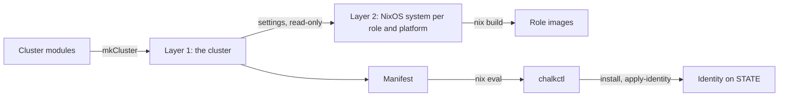

# The cluster definition

A [cluster definition](../reference/glossary.md#cluster-definition) is a set of Nix modules that
declares a whole cluster: its settings, the kinds of node it has, the machines they run on and
every node by name. chalkos evaluates it into two things: one disk
[image](../reference/glossary.md#image) per [role](../reference/glossary.md#role) and
[platform](../reference/glossary.md#platform), and a [manifest](../reference/glossary.md#manifest)
that tells [chalkctl](../reference/glossary.md#chalkctl) about every node. It is the
only inventory chalkos has, so a node that is not in the definition cannot be installed.

## How is a cluster declared?

A cluster lives in a [flake](../reference/glossary.md#flake) as `chalkos.<cluster>`, the result
of `chalkos.lib.mkCluster`. A minimal `flake.nix` declares one:

```nix title="flake.nix"
{
  inputs.chalkos.url = "github:trevex/chalkos";

  outputs =
    { chalkos, ... }:
    {
      chalkos.lab = chalkos.lib.mkCluster { modules = [ ./cluster.nix ]; };
    };
}
```

`mkCluster` takes:

- `modules`, the cluster's own modules, evaluated together with chalkos's cluster modules;
- `nixpkgs`, the nixpkgs flake the role images are built from, by default the one chalkos is
  tested against;
- `specialArgs`, extra arguments for the modules, as in any `lib.evalModules` call.

The flake pins the chalkos version in `flake.lock`, so the images a cluster builds change only
when the lock file does.

A flake may hold several clusters, each under its own name. chalkctl and
[chalklab](../reference/glossary.md#chalklab) pick the only one, or the one `--cluster` names.
Each command's `--flake` names the flake's directory, `.` by default.

With flake-parts, the module `chalkos.flakeModules.default` declares the same thing:
`chalkos.clusters.<cluster>` takes a cluster's module, sets `chalkos.cluster.name` to the
attribute's name, and exposes the result as `flake.chalkos.<cluster>`. Its `chalkos.nixpkgs`
option passes the nixpkgs flake to every cluster.

```nix title="flake.nix"
{
  inputs = {
    chalkos.url = "github:trevex/chalkos";
    flake-parts.url = "github:hercules-ci/flake-parts";
  };

  outputs =
    inputs:
    inputs.flake-parts.lib.mkFlake { inherit inputs; } {
      imports = [ inputs.chalkos.flakeModules.default ];
      systems = [ "x86_64-linux" ];
      chalkos.clusters.homelab = ./cluster.nix;
    };
}
```

## What does the option tree hold?

Every option of a cluster lives under `chalkos`. The
[options reference](../reference/options.md) lists them all; the top level groups them:

| Option | What it declares |
| --- | --- |
| `chalkos.cluster` | Name, API endpoint, OS CA, the system images are built for and the Kubernetes settings: version, subnets, VIP, registries, extra flags, manifests |
| `chalkos.roles` | The kinds of node, each with its NixOS modules, Kubernetes kind and storage defaults |
| `chalkos.nodes` | Every node by name, with its role, platform and own settings |
| `chalkos.platforms` | The kinds of machine, each with the NixOS modules its images carry |
| `chalkos.installer` | The installer's own NixOS modules and the installer image |
| `chalkos.secureBoot` | The certificate of the Secure Boot signer whose signature chalkctl requires on images |
| `chalkos.time` | The time servers every node uses |
| `chalkos.cni` | The pod network: flannel or none, and the CNI plugins the images ship |
| `chalkos.manifest` | The generated manifest, read-only |

The lab template's `cluster.nix` shows a small cluster: settings, two roles and two nodes.

```nix title="cluster.nix"
let
  labNetwork = n: {
    networks."10-lab" = {
      matchConfig.MACAddress = "52:54:00:7b:00:${n}";
      address = [ "192.168.123.${n}/24" ];
    };
  };
in
{
  chalkos.cluster = {
    name = "lab";
    endpoint = "https://192.168.123.11:6443";
    osCA = ./secrets.pub.json;
  };

  chalkos.roles.controlplane.kubernetes.kind = "controlplane";
  chalkos.roles.worker.kubernetes.kind = "worker";

  chalkos.nodes = {
    cp1 = {
      role = "controlplane";
      platform = "kvm";
      storage.system.disk = "/dev/vda";
      network = labNetwork "11";
    };
    w1 = {
      role = "worker";
      platform = "kvm";
      storage.system.disk = "/dev/vda";
      network = labNetwork "12";
    };
  };
}
```

## What is a role?

A role is a kind of node, and the unit an image is built for: every node of a role on one
platform boots the same image. A role declares:

- [`nixosModules`](../reference/options.md#chalkosrolesnixosmodules), plain NixOS modules added
  to the role's images, for a GPU driver, a monitoring agent or extra kernel
  [module groups](../reference/glossary.md#module-group);
- [`kubernetes.kind`](../reference/options.md#chalkosroleskuberneteskind): `controlplane`,
  `worker` (the default) or `null` for a role without Kubernetes;
- `storage`, defaults for its nodes' storage, applied leaf by leaf, so a node overrides one
  value or adds a volume without restating the rest.

[`images`](../reference/options.md#chalkosrolesimages) is the output:
`chalkos.<cluster>.roles.<role>.images.<platform>` builds the role's image for a platform, and
only the images asked for are evaluated. [Customise a role](../guides/customise-role.md) shows
how to extend one.

## What is a node?

A [node](../reference/glossary.md#node) is a machine of the cluster under
[`chalkos.nodes`](../reference/options.md#chalkosnodes), named by its attribute. Its options:

| Option | Default | What it sets |
| --- | --- | --- |
| [`role`](../reference/options.md#chalkosnodesrole) | none | The role whose image the node runs |
| [`platform`](../reference/options.md#chalkosnodesplatform) | `metal` | The platform whose image of the role it runs |
| [`hostname`](../reference/options.md#chalkosnodeshostname) | the node's name | The hostname set at boot |
| [`network`](../reference/options.md#chalkosnodesnetwork) | none | systemd-networkd networks, netdevs and links, in the shape of NixOS's `systemd.network` |
| [`labels`](../reference/options.md#chalkosnodeslabels), [`taints`](../reference/options.md#chalkosnodestaints) | none | The Kubernetes Node's labels and taints |
| [`storage`](../reference/options.md#chalkosnodesstoragesystemdisk) | the role's | The system disk, VAR, further volumes and encryption |
| [`kubernetes.nodeIPs`](../reference/options.md#chalkosnodeskubernetesnodeips) | `kubernetes.nodeIP`, else the first static address of each family | The addresses the kubelet registers and a control plane advertises |
| [`time.servers`](../reference/options.md#chalkosnodestimeservers) | the cluster's | Time servers that replace the cluster's |

A node's name is its name in Kubernetes too, which its kubelet certificate carries. Changing a
node's role or platform means installing it again: the node refuses an image or identity of
another role or platform than the image it runs.

## What is a platform?

A platform is the kind of machine an image runs on, declared under
[`chalkos.platforms`](../reference/options.md#chalkosplatforms) as a list of NixOS modules that
every role image for it carries before the role's own. chalkos defines two:

- `metal`: the base kernel module groups, with the console on the screen and the first serial
  port.
- `kvm`: the console on the first serial port and a QEMU guest agent that starts only under KVM.
  The host may ask the agent about the node and shut it down, never run commands or touch files.

A definition adds modules to either, or declares its own platform, for example one for a hardware
model that needs firmware the others do not. Building one image per role and platform keeps each
image small: a universal image would carry every platform's agents and drivers. The platform's
name, lower-case letters, digits and dashes, becomes `CHALKOS_PLATFORM` in the image's
os-release. [Support additional hardware](../guides/additional-hardware.md) adds a platform.

## How does the evaluation work?

`mkCluster` evaluates in two layers, because one image serves many nodes.

Layer 1 is the cluster: chalkos's cluster modules and the definition's modules, evaluated with
`lib.evalModules`. It knows every node, and it produces the manifest.

Layer 2 is one NixOS system per role and platform, built from chalkos's node modules, the
platform's modules and the role's modules. The cluster's settings reach it as read-only options
under the same names: everything under `chalkos` except `nodes`, `roles`, `platforms`,
`installer`, `manifest` and the internal warnings. So a role's module reads
`config.chalkos.cluster.endpoint` or a feature's settings, and cannot change them.

Node values do not exist in layer 2. `config.chalkos.nodes` throws inside a role image with an
error that says so, because the same image runs on every node of the role. A module that needs a
node's value reads it at runtime, from the [identity](#what-does-a-node-receive-at-runtime).

The flowchart shows both layers and where their results go.



The installer is a layer 2 system too, built from the node modules, the cluster's settings and
[`chalkos.installer.nixosModules`](../reference/options.md#chalkosinstallernixosmodules), with no
role or platform.

## What is the manifest?

The manifest is the JSON document layer 1 generates at `chalkos.<cluster>.manifest`. It is how Go
code reads what Nix declared: chalkctl evaluates it with `nix eval` and learns nothing about the
cluster from anywhere else. In the directory of the
[homelab example](https://github.com/trevex/chalkos/tree/main/examples/homelab):

```console
$ nix eval --json .#chalkos.homelab.manifest | jq '{schemaVersion, cluster, roles}'
{
  "schemaVersion": 0,
  "cluster": {
    "endpoint": "https://10.0.0.11:6443",
    "name": "homelab"
  },
  "roles": {
    "controlplane": {
      "images": {
        "kvm": "roles.controlplane.images.kvm",
        "metal": "roles.controlplane.images.metal"
      },
      "kind": "controlplane"
    },
    "worker": {
      "images": {
        "kvm": "roles.worker.images.kvm",
        "metal": "roles.worker.images.metal"
      },
      "kind": "worker"
    }
  }
}
```

Besides these, it holds `secureBoot.signerCertificate` and, under `nodes`, each node's role,
platform and identity. A role's images are attribute paths relative to the cluster, which
chalkctl builds when a command needs an image. While `schemaVersion` is 0 the format may change
between chalkos versions, which matters only to tools other than chalkctl and chalklab.

`chalkctl --manifest=<file>` reads a manifest from a file instead of evaluating the flake. It
cannot build images then, so commands that need one take `--image`.

## What does a node receive at runtime?

A node's [identity](../reference/glossary.md#identity) is its part of the manifest: everything
about the node, without secrets. The homelab's `cp1`, in part:

```console
$ nix eval --json .#chalkos.homelab.manifest.nodes.cp1.identity \
  | jq '{cluster, role, platform, hostname, networkUnits, kubernetes, extensions}'
{
  "cluster": "homelab",
  "role": "controlplane",
  "platform": "metal",
  "hostname": "cp1",
  "networkUnits": {
    "10-uplink.network": "[Match]\nName=enp1s0\n\n[Network]\nAddress=10.0.0.11/24\nGateway=10.0.0.1\n\n"
  },
  "kubernetes": {
    "nodeIPs": [
      "10.0.0.11"
    ],
    "nodeName": "cp1",
    "validSubnets": null
  },
  "extensions": {
    "rack": {
      "location": "rack-a/u12"
    }
  }
}
```

Layer 1 renders the node's network into unit files with the role image's own networkd renderer,
so a unit means on the node exactly what it would mean in NixOS. The storage section, left out
above, holds the node's disks with their repart definitions and its volumes.

chalkctl delivers the identity at install, and later with
[`chalkctl apply-identity`](../reference/cli/chalkctl_apply-identity.md); the secrets travel
beside it in the same request, never in the identity. [chalkd](../reference/glossary.md#chalkd)
keeps the identity on [STATE](../reference/glossary.md#state) as `identity.json`. At every boot,
`chalkos-identity.service` applies it before the network starts:

- it writes the whole identity to `/run/chalkos/node.json`, which
  [`chalkos.node.file`](../reference/options.md#chalkosnodefile) names;
- it writes the networkd units to `/run/systemd/network`, where they take precedence over the
  image's;
- it writes the time servers for chrony and sets the hostname;
- it writes one file per key a service reads to `/run/chalkos/credentials/`.

A service that needs a node's value declares the keys it reads under
[`chalkos.node.consumers`](../reference/options.md#chalkosnodeconsumers). Each key becomes a
systemd credential of the same name, read from `$CREDENTIALS_DIRECTORY` or `%d` in the unit. A
key is a dotted path, looked up in the identity's `extensions` first and then in the identity
itself, so `rack.location` and `hostname` both work. When `chalkctl apply-identity` changes a
key's value, chalkd restarts the units that read it, unless they set `restartOnChange = false`.

[`chalkctl status`](../reference/cli/chalkctl_status.md) shows whether a node runs the identity
the cluster definition gives, by comparing the SHA-256 of the identity it would deliver with the
node's.

## How does an extension add options?

An [extension](../reference/glossary.md#extension) is a cluster module that declares options
under a namespace of its own, optionally adds per-node options and contributes NixOS modules to
roles. chalkos's own features, such as `chalkos.cni`, use the same mechanism. The homelab's rack
extension records where each node is mounted and hands the value to a service on that node:

```nix title="extensions/rack.nix"
{ config, lib, ... }:
{
  options.chalkos.rack.enable = lib.mkEnableOption "rack position reporting";

  options.chalkos.nodes = lib.mkOption {
    type = lib.types.attrsOf (
      lib.types.submodule {
        options.rack.location = lib.mkOption {
          type = lib.types.str;
          example = "rack-a/u12";
          description = "Rack and height unit the node is mounted in.";
        };
      }
    );
  };

  config = lib.mkIf config.chalkos.rack.enable {
    chalkos.roles = lib.genAttrs [ "controlplane" "worker" ] (_: {
      nixosModules = [
        (
          { pkgs, ... }:
          {
            systemd.services.rack-location = {
              wantedBy = [ "multi-user.target" ];
              serviceConfig = {
                Type = "oneshot";
                ExecStart = "${pkgs.coreutils}/bin/cat %d/rack.location";
              };
            };
            chalkos.node.consumers.rack-location.keys = [ "rack.location" ];
          }
        )
      ];
    });
  };
}
```

The three parts reach the node by different paths:

- `chalkos.rack.enable` is a cluster setting, so every image of the cluster can read it as
  `config.chalkos.rack.enable`.
- `chalkos.nodes.<node>.rack.location` is a per-node option. Every node option that chalkos does
  not declare itself lands in the identity's `extensions`, here as `rack.location`.
- The role module runs a unit that reads the value as a credential, and chalkd restarts it when
  the value changes.

A namespace must not collide with the names chalkos uses inside images: `node`, `disk`, `role`
and `nodes` are taken.

## Where does the OS CA come from?

[`chalkctl gen secrets`](../reference/cli/chalkctl_gen_secrets.md) writes the cluster's
[secrets file](../reference/glossary.md#secrets-file) and its public part, `secrets.pub.json`.
[`chalkos.cluster.osCA`](../reference/options.md#chalkosclusterosca) points to the public part,
which holds certificates and no keys, so it belongs in the repository. Role images and the
installer then carry the cluster's
[OS CA](../reference/glossary.md#os-ca), so chalkd in
[maintenance mode](../reference/glossary.md#maintenance-mode) accepts only clients with a
certificate from it. chalkos reads version 3 of the file only; evaluation fails on another
version and says to generate new secrets. Left `null`, images accept any client until they are
installed, which suits a lab on a private network and nothing else.

No module reads the secrets file itself. chalkctl reads it from the flake's directory, or the
path `--secrets` names, when it installs a node or issues a certificate. The lab template's
`.gitignore` keeps the plaintext `secrets.json` out of git, and so out of the Nix store, which
copies a flake's tracked files.

## Limits

- One image serves every node of a role and platform, so anything that differs between two
  nodes must travel in the identity. A per-node kernel parameter or package is a role or platform
  of its own.
- The identity carries data, not code. A new service, or a change to how a service reads its
  value, is an image change and an [upgrade](upgrades.md).
- `chalkos.secureBoot.enrollment` and `chalkos.secureBoot.require` are declared and appear in the
  options reference, but nothing reads them yet: chalkos does not enrol Secure Boot keys.
- The manifest's format is unstable while `schemaVersion` is 0.

## Related pages

- [Architecture](architecture.md) for where the definition's outputs go.
- [The image](image.md) for what a role image holds.
- [Storage and encryption](storage.md) for the storage options of roles and nodes.
- [Customise a role](../guides/customise-role.md) for extending a role with NixOS modules.
- [Cluster and node options](../reference/options.md) for every option.
