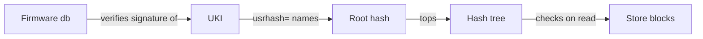

# The image

A role [image](../reference/glossary.md#image) is the whole operating system of a node in one
unsigned raw disk image: systemd-boot, a [UKI](../reference/glossary.md#uki) with the kernel and
initrd, and a read-only Nix [store](../reference/glossary.md#store). chalkos builds one per
[role](../reference/glossary.md#role) and [platform](../reference/glossary.md#platform), and every
node of that role and platform boots the same bytes. One signature on the UKI covers the whole
store, so the firmware's signature check extends to every block the node reads, and an upgrade
replaces all of it at once.

## What does an image hold?

An image holds three partitions. The first boot adds the rest of the system region behind them.
The table names the x86-64 boot loader; an arm64 image has `BOOTAA64.EFI`.

| Partition | Size | Contents |
| --- | --- | --- |
| [ESP](../reference/glossary.md#esp) | 1 GiB | systemd-boot as `/EFI/BOOT/BOOTX64.EFI` and the UKI as `/EFI/Linux/chalkos_<version>.efi` |
| Slot A, hash tree | 128 MiB | The store's [dm-verity](../reference/glossary.md#dm-verity) hash tree, labelled `store-verity_<version>` |
| Slot A, data | 3 GiB | The store as erofs, labelled `store_<version>` |

On its first boot, systemd-repart in the initrd adds slot B, two partitions of the same sizes
labelled `_empty`, and [STATE](../reference/glossary.md#state), 128 MiB, encrypted and sealed to
the [TPM](../reference/glossary.md#tpm). The [installer](../reference/glossary.md#installer) lays
out the same partitions on its target disk in one run. [VAR](../reference/glossary.md#var) and further volumes come from the
node's storage settings at install. The sizes are the defaults of
[`chalkos.disk`](../reference/options.md#chalkosdiskstoresize); a slot's size is fixed at install
and is the room every later upgrade has. [Image and partition layout](../reference/image-layout.md)
lists every partition with its type and label.

## Why is the system read-only?

A node built from an image cannot drift from it. Role images use NixOS's image-based appliance
profile:

- No Nix daemon and no `switch-to-configuration`: the system cannot be rebuilt on the node.
- The root file system is a tmpfs, so nothing written outside STATE and VAR survives a reboot.
- `/etc` is assembled from the image at boot and stays read-only.
- Users and groups are fixed at build time. Nodes have no interactive logins, so no account needs
  a password or an SSH key.
- The image avoids Perl and keeps interpreters out where it can.

What a node must keep goes to two partitions: STATE for its [identity](../reference/glossary.md#identity), certificates and Kubernetes
secrets, and VAR at `/var` for etcd, containerd, the kubelet and logs.
[Storage and encryption](storage.md) describes both.

## How is the store built?

A slot's data partition holds the store as an erofs file system compressed with zstd at level 9 in 64 KiB clusters
(`-zzstd,level=9 -C65536`), with 4 KiB blocks. These settings come within 3% of zstd level 15's
size at a sixth of its build time, and the kernel's erofs reads zstd. An upgrade sends the
compressed file system, so compression shrinks every transfer by the same factor.

The initrd mounts the store read-only at `/usr` and binds its `nix/store` to `/nix/store`. The
store holds no kernel or initrd: the UKI carries both, and the build fails if anything brings
them back into the system's closure.

## How does dm-verity protect the store?

dm-verity checks every block of the store against a hash tree when it is read, so a modified
block fails to read. The tree's top hash, the [root hash](../reference/glossary.md#root-hash), is
on the UKI's kernel command line as `usrhash=`. The UKI is signed, and
[Secure Boot](../reference/glossary.md#secure-boot) verifies the signature before the firmware
starts it, so the firmware's check covers the whole store.



Both the data and the hash tree use 4 KiB blocks. dm-verity refuses blocks smaller than a disk's
logical block size, so 512-byte blocks would not open on 4Kn disks; 4 KiB blocks also make the
tree an eighth of the size, about 2 MiB for a Kubernetes role.

The initrd finds the store by its partition UUIDs, never by its labels. systemd derives both from
the root hash: the data partition's UUID is the hash's first 128 bits and the hash tree's its last
128 bits. A slot that holds another store, or a store written in part, has other UUIDs, so the
UKI cannot boot it. Kernel modules need no signatures of their own for the same reason: they live
in the store, which the root hash pins.

## What is in the UKI?

The UKI is one EFI binary with four parts that matter here:

- the kernel;
- the initrd, compressed with zstd at level 19, which makes it a tenth smaller than NixOS's
  default;
- the kernel command line, with `usrhash=` and the platform's console settings;
- os-release, which names the image.

Its os-release fields tell [chalkd](../reference/glossary.md#chalkd) what an image is before it
installs it. chalkd reads them from the UKI, whose signature covers them, and refuses an image
whose fields do not match the node:

| Field | Value |
| --- | --- |
| `IMAGE_ID` | `chalkos`, or `chalkos-installer` on the installer |
| `IMAGE_VERSION` | the [image version](#what-may-an-image-version-be) |
| `CHALKOS_CLUSTER` | the cluster's name |
| `CHALKOS_ROLE` | the role's name, absent on the installer |
| `CHALKOS_PLATFORM` | the platform's name, absent on the installer |
| `CHALKOS_BOOT_TRIES` | [`chalkos.upgrade.bootTries`](../reference/options.md#chalkosupgradeboottries) of the image |

[os-release fields](../reference/os-release.md) lists them all.

The UKI is about 44 MiB for a Kubernetes role, most of it the initrd, which carries the file
system tools that systemd-repart needs to create volumes and the libraries of systemd's TPM and
crypto support. The ESP holds a UKI per slot and, during an upgrade, a third, temporary copy.

## How does systemd-boot pick the UKI?

systemd-boot is the boot loader the firmware starts from the ESP's default path, so a disk boots
without a firmware boot entry. It lists the UKIs in `/EFI/Linux`, sorts those of one image ID by
version, newest first, and boots the first whose tries are not used up, unless the EFI variable
`LoaderEntryPreferred` names another. An upgrade sets that variable, which is how an older
version boots after a downgrade. [Boot, health and rollback](boot-and-rollback.md) follows the
boot from there.

An upgrade replaces the UKI and the store, never systemd-boot: the boot loader a node was
installed with stays.

## What are slots A and B?

A [slot](../reference/glossary.md#slot) is a pair of partitions that holds one image's store: its
hash tree and its data. A node has two, A and B, which is the [A/B](../reference/glossary.md#a-b)
scheme: the node boots one slot while an upgrade writes the other, so the image it ran before
stays on disk for a [rollback](../reference/glossary.md#rollback).

Nothing records which slot is active. The partitions say it, here with the GPT types of an x86-64
image:

| Partition | GPT type | Label | Partition UUID |
| --- | --- | --- | --- |
| Hash tree of a slot in use | `usr-x86-64-verity` | `store-verity_<version>` | the root hash's last 128 bits |
| Data of a slot in use | `usr-x86-64` | `store_<version>` | the root hash's first 128 bits |
| Either partition of a slot not in use | as above | `_empty` | random |

The labels name the version for people and tools; the boot never reads them. An upgrade first
gives the inactive slot random UUIDs and the label `_empty`, writes it, verifies it and only then
gives it the UUIDs of its root hash and labels of its version. [Upgrades](upgrades.md) describes
the steps.

## What may an image version be?

An image version, [`system.image.version`](https://search.nixos.org/options?query=system.image.version)
in a role's modules and `0.1.0` by default, is 1 to 23 characters of `a-z`, `0-9`, `.`, `~`, `^`
and `-`, starting with a letter or digit. The build refuses any other, and so do
[chalkctl](../reference/glossary.md#chalkctl) and chalkd. The limits come from where the version
appears:

- in the slot's labels: a GPT label holds 36 characters, and `store-verity_` takes 13;
- in the UKI's file name, `chalkos_<version>.efi`: systemd-boot keeps an entry ID's case only
  when it has a tries counter, so upper case is out, and `+` starts the counter;
- in os-release as `IMAGE_VERSION`.

A version names one build. A node refuses an image whose version it already runs or holds with
another root hash, with the message to build the image with a new version, because two builds of
one version would collide on the ESP. The same version with the same root hash is already
installed and changes nothing.

## What does a platform add?

A platform's NixOS modules come before the role's in each of its images. chalkos's `metal`
platform sets the console to the screen and the first serial port, where a BMC's serial-over-LAN
shows it. Its `kvm` platform sets the console to the first serial port and adds the QEMU guest
agent, about 6 MiB of store, limited to reporting on the node and shutting it down. A platform
that a cluster declares adds firmware, kernel module groups or agents to the images for that kind
of machine alone.
[The cluster definition](cluster-definition.md#what-is-a-platform) explains platforms.

## Which kernel modules does an image carry?

An image carries a filtered copy of nixpkgs's prebuilt kernel module tree, so the kernel itself is
nixpkgs's and comes from its binary cache. [Module groups](../reference/glossary.md#module-group),
listed in [`chalkos.kernel.moduleGroups`](../reference/options.md#chalkoskernelmodulegroups), pick
what the tree keeps. Most groups name directories of the tree, so a kernel update brings a
subsystem's new drivers along.

| Groups | Included by default | What they cover |
| --- | --- | --- |
| `storage`, `network`, `virtualisation`, `filesystems`, `kubernetes`, `platform` | yes | Disk controllers, wired Ethernet, virtio and other hypervisors' drivers, the file systems nodes and CSI drivers mount, netfilter and traffic control, TPM, watchdogs, IPMI, sensors and the console's keyboard |
| `gpu`, `sound`, `media`, `wireless`, `infiniband`, `can`, `industrial` | no | Added per role, for example `chalkos.kernel.moduleGroups = [ "gpu" ];` |

A role's definition adds to the base groups, and `lib.mkForce` replaces them.
[`chalkos.kernel.extraModules`](../reference/options.md#chalkoskernelextramodules) adds single
modules by name with their dependencies, and
[`chalkos.kernel.allModules`](../reference/options.md#chalkoskernelallmodules) keeps the whole
tree. Out-of-tree modules from NixOS's `boot.extraModulePackages` are always included whole.

The base groups keep about a third of the kernel's 7,300 modules, about 45 MiB of the full
tree's 145 MiB. A missing module fails the build, not the boot: the build checks that every
module the image loads by name, and every dependency of a module in the tree, is in the tree.
[Support additional hardware](../guides/additional-hardware.md) adds drivers and firmware.

## What is on the system path?

Nodes have no logins, so the system path holds none of NixOS's default packages: only what the
image's own modules put there, such as systemd, bash, less, nftables, kmod and the mount helpers,
and what a role adds. Each service names the tools it runs in its own path.

[`chalkos.debug.tools`](../reference/options.md#chalkosdebugtools) adds coreutils, grep, sed,
findutils, procps, iproute2 and util-linux, and crictl on roles with Kubernetes. They are used
from a privileged pod that enters the node's root:

```sh
kubectl debug node/<node> -it --profile=sysadmin --image=busybox -- \
  chroot /host /run/current-system/sw/bin/bash
```

`<node>` is the Kubernetes node's name. `--profile=sysadmin` makes the pod privileged, which
tools such as `nft` need; kubectl's default profile leaves it without their capabilities. A node
has no `/bin/bash`, so the command names the system path's.

## How large is an image?

A Kubernetes role's image for `metal` measures about 246 MiB of store data, a 2 MiB hash tree and
a 44 MiB UKI; for `kvm`, 6 MiB more store. An upgrade sends those three parts, about 300 MiB per
node. The raw image is 4.2 GiB of apparent size, mostly the empty room of its slot, and sparse on
disk.

Every image build checks that the image leaves room for the next one. The build fails when:

- the store's data takes more than 80% of
  [`chalkos.disk.storeSize`](../reference/options.md#chalkosdiskstoresize);
- the hash tree takes more than 80% of
  [`chalkos.disk.storeVeritySize`](../reference/options.md#chalkosdiskstoreveritysize);
- three UKIs, both slots' and an upgrade's temporary copy, take more than 80% of
  [`chalkos.disk.espSize`](../reference/options.md#chalkosdiskespsize).

The installer, which is never upgraded, has a store sized to its contents and is checked for one
UKI. The check runs against the sizes the image declares; a node checks an upgrade against the
slot sizes it was installed with, and refuses a store that does not fit them.

## How is an image built?

`nix build` builds one role's image for one platform. In the lab template's flake, the [worker](../reference/glossary.md#worker)'s
`kvm` image:

```console
$ nix build .#chalkos.lab.roles.worker.images.kvm
$ ls result
chalkos_0.1.0.raw
repart.d
repart-output.json
```

- `chalkos_<version>.raw` is the raw disk image.
- `repart-output.json` is systemd-repart's report of its partitions, with their offsets, sizes
  and the root hash. chalkctl reads the store, the hash tree and the UKI at those offsets.
- `repart.d` holds the role's partition definitions of the system region, which the installer
  lays out a target disk with.

The image is unsigned, and the signing key never enters the Nix store. chalkctl signs at the
last moment:

- [`chalkctl install`](../reference/cli/chalkctl_install.md) and
  [`chalkctl upgrade`](../reference/cli/chalkctl_upgrade.md) sign the UKI, and for an install the
  boot loader, with `--sign-key` and `--sign-cert` before they send them.
- [`chalkctl sign`](../reference/cli/chalkctl_sign.md) signs the boot loader and UKI on a raw
  image's ESP in place, for an image written with `dd` or used as a VM's disk. An image in the
  Nix store is read-only, so it signs a copy:

```sh
install -m 644 result/chalkos_0.1.0.raw worker.raw
chalkctl sign --image=worker.raw --repart-json=result/repart-output.json \
  --key=<db-key> --cert=<db-cert>
```

`<db-key>` and `<db-cert>` are the PEM key and certificate of a signer the machines' firmware
trusts in [db](../reference/glossary.md#db-and-dbx). [Sign images for Secure Boot](../guides/secure-boot-signing.md) covers the keys.

chalkos does not wrap image conversion. `qemu-img convert -f raw -O qcow2` makes a qcow2 disk for
KVM, `zstd` compresses an image for transport and `dd` or a USB writer puts it on a disk.

## Limits

- An upgrade sends the whole compressed store, about 250 MiB for a Kubernetes role, to every
  node; there are no delta updates.
- An upgrade never replaces systemd-boot. A node keeps the boot loader it was installed with.
- Slot sizes are fixed at install. A store that outgrows the slots of installed nodes cannot be
  installed on them.
- The image carries no firmware unless a role or platform adds it with NixOS's
  `hardware.firmware`.
- Images are built and signed on the operator's machine and sent by chalkctl; chalkos publishes no
  images and pulls none from a registry.

## Related pages

- [Boot, health and rollback](boot-and-rollback.md) for how a node boots the image.
- [Upgrades](upgrades.md) for how a new image reaches a node.
- [Security model](security.md) for what Secure Boot and dm-verity protect against.
- [Image and partition layout](../reference/image-layout.md) and
  [os-release fields](../reference/os-release.md) for the details.
- [Customise a role](../guides/customise-role.md),
  [Support additional hardware](../guides/additional-hardware.md) and
  [Sign images for Secure Boot](../guides/secure-boot-signing.md) for the tasks.
