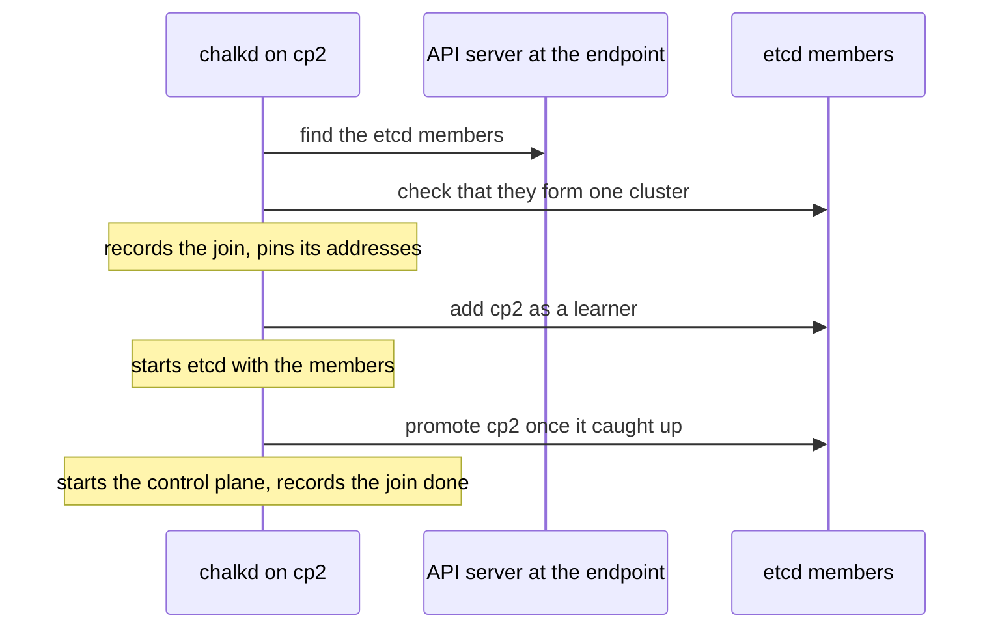

# Kubernetes on chalkos

chalkos runs upstream Kubernetes in the layout kubeadm uses, without kubeadm. containerd and the
kubelet are systemd units of the image; etcd, the API server, the controller-manager and the
scheduler run as static pods from the upstream images, which
[chalkd](../reference/glossary.md#chalkd) renders on every
[control plane](../reference/glossary.md#control-plane). Certificates come from the cluster's
[secrets file](../reference/glossary.md#secrets-file) instead of `kubeadm init`, control planes
join etcd on their own, and chalkd applies the cluster's add-ons at every boot.

## Which Kubernetes does a node run?

One Kubernetes version per image:
[`chalkos.cluster.kubernetes.package`](../reference/options.md#chalkosclusterkubernetespackage),
nixpkgs's `kubernetes` by default. Nodes run its kubelet; the control plane runs the upstream
images of the same version from `registry.k8s.io`, so a node's kubelet and control plane always run
the same version. etcd, the pause image and CoreDNS have their own images under
[`chalkos.cluster.kubernetes.images`](../reference/options.md#chalkosclusterkubernetesimagesetcd).
A Kubernetes upgrade is therefore an image [upgrade](../reference/glossary.md#upgrade), rolled
through the cluster like any other, as [Upgrades](upgrades.md) describes.

A [role](../reference/glossary.md#role) decides what its nodes are in Kubernetes with
[`kubernetes.kind`](../reference/options.md#chalkosroleskuberneteskind):

| Kind | Runs |
| --- | --- |
| `controlplane` | containerd, the kubelet, and etcd and the control plane as static pods |
| `worker` (default) | containerd and the kubelet |
| `null` | No Kubernetes at all; the image leaves it out |

## What runs on every node?

containerd and the kubelet run as systemd units from the image. Before the kubelet starts,
`chalkos-kubernetes.service` prepares the node: it picks the node's addresses, as
[Networking](networking.md) describes, issues a control plane's certificates, and writes the
kubelet's kubeconfig and per-node flags below `/run/chalkos/kubernetes`. A node without a
[Kubernetes share](../reference/glossary.md#kubernetes-share), which is not installed yet, runs no
kubelet.

The kubelet's configuration comes from Nix and is the same on every node of the image:
webhook authentication and authorisation, no anonymous access and no read-only port, the systemd
cgroup driver, and `rotateCertificates` with `serverTLSBootstrap`. What differs per node comes from
the node's [identity](../reference/glossary.md#identity) as flags: the node name, its addresses,
its labels and its taints. A control plane is tainted `node-role.kubernetes.io/control-plane:NoSchedule`
unless [`chalkos.cluster.kubernetes.allowSchedulingOnControlPlanes`](../reference/options.md#chalkosclusterkubernetesallowschedulingoncontrolplanes)
is set. [`chalkos.cluster.kubernetes.extraArgs.kubelet`](../reference/options.md#chalkosclusterkubernetesextraargskubelet)
adds flags.

containerd pulls through the mirrors of
[`chalkos.cluster.registries.mirrors`](../reference/options.md#chalkosclusterregistriesmirrors),
tried in order before the registry itself. Mirrors must be `https://` URLs, because nothing
authenticates what a plain HTTP mirror serves; `allowPlainHTTP` exists for test registries.

## How does the control plane run?

chalkd renders the static pods of etcd, the API server, the controller-manager and the scheduler
into `/run/chalkos/kubernetes/manifests`, where the kubelet picks them up. Their certificates are
issued at every boot into `/run/chalkos/kubernetes/pki`, a tmpfs mounted into the pods as
`/etc/kubernetes/pki`. Each pod carries a hash of the certificates it mounts in the annotation
`chalkos.dev/certificates`, so when chalkd renews the certificates the kubelet starts the pod
again on the new files. etcd keeps its data on [VAR](../reference/glossary.md#var) in
`/var/lib/etcd`.

The flags are close to kubeadm's, with a few chalkos choices: the API server talks to its node's own
[etcd member](../reference/glossary.md#etcd-member) only, authorises with `Node,RBAC` and admits with `NodeRestriction`, allows anonymous
requests only to `/livez`, `/readyz` and `/healthz`, has bootstrap-token authentication off, and
encrypts Secrets in etcd with the cluster's encryption key. The controller-manager runs without the
bootstrap-signer and token-cleaner controllers, since nothing uses bootstrap tokens.
[`chalkos.cluster.kubernetes.extraArgs`](../reference/options.md#chalkosclusterkubernetesextraargskube-apiserver)
adds or overrides flags per component, except the API server's `anonymous-auth`,
`authentication-config`, `authorization-mode` and `enable-bootstrap-token-auth`, which decide who
may do what and are refused.

## How does a cluster start?

One control plane initialises etcd, once, with
[`chalkctl bootstrap`](../reference/cli/chalkctl_bootstrap.md):

```sh
chalkctl bootstrap <node>
```

chalkd records the [bootstrap](../reference/glossary.md#bootstrap) on
[STATE](../reference/glossary.md#state) before it starts anything, so a failure after that point
is retried by the next boot and never initialises a second cluster. It then renders the static
pods with an etcd of one member, waits for the API server, and applies the cluster's manifests;
chalkctl waits until they are applied, up to `--timeout` (20 minutes by default). The node refuses
to bootstrap when it is bootstrapped already, has joined or is joining a cluster, holds etcd data,
has left etcd, or finds the cluster's API server answering at the endpoint, because then a cluster
exists and the node joins it instead.

## How do further control planes join?

Every other control plane joins on its own; there is no join command. A control plane that is not
bootstrapped looks for the cluster at the endpoint: it finds the etcd members through the API
server there, which must present a certificate of the cluster's Kubernetes CA, and joins through
them. The sequence shows a second control plane, cp2, joining.



A learner receives etcd's data without voting, so a member that is still catching up never counts
toward the quorum. etcd accepts one learner at a time, so control planes that boot together join
one after another. A node that was interrupted resumes from its markers on STATE, and the join
gives up on a promotion that does not complete within 10 minutes and tries again later.

The join stops, and the node's status says why, when etcd has a member of the node's name that the
node did not add itself: a control plane that was reinstalled without leaving etcd. That stale
member is never removed automatically, because only the operator knows whether the machine that
owned it is gone. [`chalkctl etcd`](../reference/cli/chalkctl_etcd.md) manages the membership:

```sh
chalkctl etcd members
chalkctl etcd remove-member <node>
chalkctl etcd leave <node>
```

`remove-member` removes another node's member and `leave` takes a node out itself, releasing its
[VIPs](../reference/glossary.md#vip), stopping its control plane, deleting its etcd data and unpinning its addresses. Both refuse
when the voters left would have fewer healthy members than their quorum; `remove-member --force`
removes a member anyway. A node that left joins again only after a reinstall.

## How do workers join?

A [worker](../reference/glossary.md#worker) receives a kubelet client certificate for its own node
name in its share at install, and its kubelet registers at the [cluster endpoint](../reference/glossary.md#cluster-endpoint) with it. There is
no bootstrap token and no join step. The kubelet renews the certificate itself through a
certificate request, which the controller-manager approves for nodes renewing their own.

Every kubelet also requests a serving certificate, which the API server checks when it fetches logs
or execs into a pod. chalkd on the control planes approves such a request when a node asks for its
own name, for server use only, and for addresses its Node object lists; it leaves every other
request pending. [Certificates](certificates.md) lists every certificate and its lifetime.

## What does the control plane apply?

After the API server is ready, chalkd applies a list of objects with server-side apply, as field
manager `chalkd`, taking over fields other managers changed, so the image's objects always win:

1. RBAC: `chalkos:cluster-admins` bound to `cluster-admin` for admin kubeconfigs, the binding that
   lets kubelets renew their own client certificates, and the API server's access to kubelets.
2. kube-proxy, as a DaemonSet in nftables mode.
3. The pod network, flannel unless [`chalkos.cni.provider`](../reference/options.md#chalkoscniprovider)
   is `none`.
4. CoreDNS, at the primary family's address of
   [`dnsIPs`](../reference/options.md#chalkosclusterkubernetesdnsipsipv4).
5. The objects of [`chalkos.cluster.manifests`](../reference/options.md#chalkosclustermanifests),
   in their order.

chalkd applies the list at bootstrap and again on every bootstrapped control plane each time it
starts, so an image upgrade rolls out changed add-ons without a separate step. Then it runs the
approver of kubelet serving certificates.

```nix
chalkos.cluster.manifests = [
  { apiVersion = "v1"; kind = "Namespace"; metadata.name = "apps"; }
];
```

## How is the cluster reached?

[`chalkctl kubeconfig`](../reference/cli/chalkctl_kubeconfig.md) writes an admin kubeconfig from
the secrets file, for the cluster endpoint, with a client certificate in `chalkos:cluster-admins`:

```sh
chalkctl kubeconfig --out=<file>
```

`--server` points it at another URL, such as a forwarded port, while it still verifies the API
server's certificate for the endpoint.

## What does the status show?

[`chalkctl status`](../reference/cli/chalkctl_status.md) shows a node's Kubernetes side in one
line: its kind and state, whether its Node is Ready, the VIP role of a control plane, and whether
the control plane runs on its current certificates. A healthy control plane that holds the VIP
reads:

```text
kubernetes controlplane: bootstrapped, node ready: True, vip holder, control plane current
```

Other states name what the node waits for or why it stopped:

| State | Meaning |
| --- | --- |
| `waiting for bootstrap or for the cluster at <endpoint>` | A control plane that found no cluster to join yet |
| `joining the cluster at <endpoint>: <step>` | A join that runs, with its step or its last error |
| `bootstrapped` | A control plane that is an etcd voter, by bootstrap or join |
| `joined` | A worker |
| `preparation failed: <reason>` | The preparation stopped, for example because no address matched |
| `left etcd; reinstall the node to join the cluster again` | A control plane after `chalkctl etcd leave` |
| `etcd data missing: restore etcd or reinstall the node` | A bootstrapped control plane whose etcd data is gone, as after VAR was lost |

## Limits

- An object removed from `chalkos.cluster.manifests` is not deleted from the cluster; delete it
  with kubectl.
- chalkos has no etcd backup or restore command. etcd's data lives only on the control planes'
  VAR partitions.
- The API server on a control plane uses only its own etcd member. When that member is unhealthy,
  that node's API server fails its readiness and the VIP moves to another control plane.
- A cluster of one or two control planes loses etcd's quorum, and with it the API server, while a
  control plane reboots. Use three control planes; one is fine for a lab.
- The approver of kubelet serving certificates trusts the addresses a kubelet reports for its own
  Node, as the [Security model](security.md) explains.

## Related pages

- [Networking](networking.md): node addresses, the VIP and the pod network.
- [Certificates](certificates.md): the CAs and certificates the cluster runs on.
- [Upgrades](upgrades.md): how a new Kubernetes version reaches the nodes.
- [Install on bare metal](../guides/install-bare-metal.md#bootstrap-the-first-control-plane) for
  the bootstrap, and [Run a highly available control plane](../guides/ha-control-plane.md) for
  joins and membership changes.
- [`chalkctl bootstrap`](../reference/cli/chalkctl_bootstrap.md),
  [`chalkctl kubeconfig`](../reference/cli/chalkctl_kubeconfig.md),
  [`chalkctl etcd`](../reference/cli/chalkctl_etcd.md) and
  [`chalkos.cluster.manifests`](../reference/options.md#chalkosclustermanifests).
