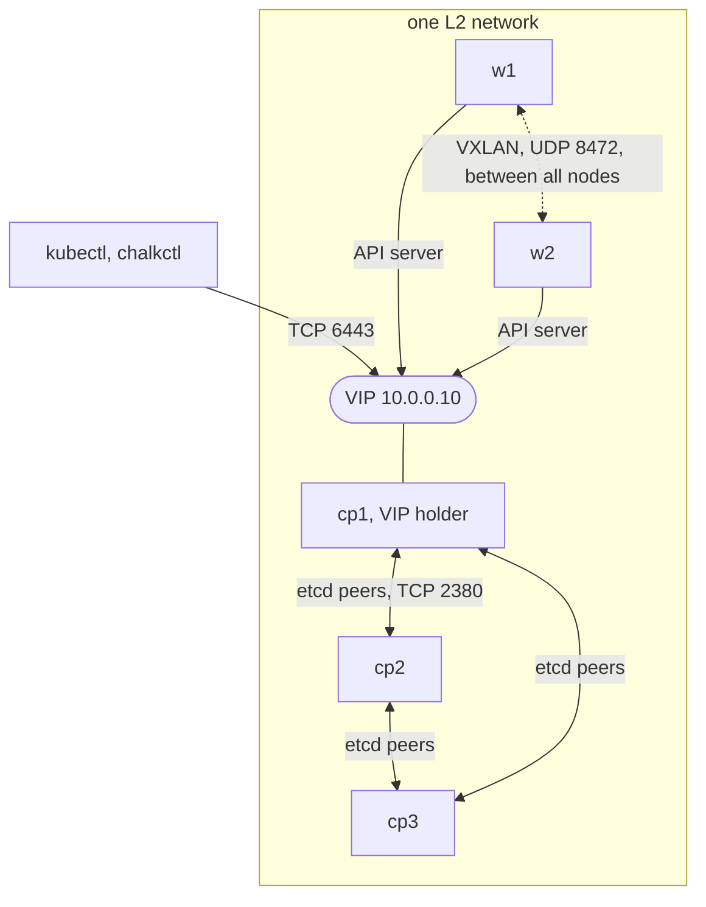

# Networking

A chalkos node configures its interfaces with systemd-networkd from its
[identity](../reference/glossary.md#identity), picks one address per IP family for Kubernetes,
and filters traffic with nftables. Control planes can share a virtual IP, the
[VIP](../reference/glossary.md#vip), that one healthy control plane holds at a time, and flannel
connects pods across nodes with VXLAN.

## How does a node configure its interfaces?

A node's `network` in the [cluster definition](../reference/glossary.md#cluster-definition) is systemd-networkd configuration in the shape of
NixOS's `systemd.network` options: `networks`, `netdevs` and `links`. chalkos renders it into unit
files with the role image's own NixOS renderer, so a unit means on the node what it means on
NixOS, and the node's identity carries the files. At every boot `chalkos-identity.service` writes
them from the identity on [STATE](../reference/glossary.md#state) to `/run/systemd/network`,
where they take precedence over the image's.

```nix
chalkos.nodes.cp1.network.networks."10-uplink" = {
  matchConfig.Name = "enp1s0";
  address = [ "10.0.0.11/24" ];
  gateway = [ "10.0.0.1" ];
};
```

The image brings one unit of its own, NixOS's `99-ethernet-default-dhcp`, which runs DHCP on every
physical Ethernet interface that no earlier unit matches. A node whose identity declares no
network therefore still comes up with DHCP. A changed network reaches a running node with
[`chalkctl apply-identity`](../reference/cli/chalkctl_apply-identity.md).

## Which addresses does a node use for Kubernetes?

A node with Kubernetes registers one address of each IP family of the cluster. On a
[control plane](../reference/glossary.md#control-plane), its certificates name the same addresses,
and etcd and the API server advertise the primary family's. Before the kubelet starts, the preparation
(`chalkos-kubernetes.service`) picks them and writes them to `/run/chalkos/kubernetes/node-ip`.

A family's address is fixed or picked:

- Fixed: [`chalkos.nodes.<name>.kubernetes.nodeIPs`](../reference/options.md#chalkosnodeskubernetesnodeips),
  or `nodeIP` for one address. By default it is the node's first static address of each family in
  its network, unless subnets to pick from apply to the node. The node waits until an interface
  holds the address.
- Picked: the node takes the first of its global unicast addresses that
  [`chalkos.cluster.kubernetes.nodeIP.validSubnets`](../reference/options.md#chalkosclusterkubernetesnodeipvalidsubnets)
  selects, or a node's own `validSubnets`. A leading `!` excludes a subnet. Addresses are compared
  IPv4 before IPv6, then by interface name and address, so the choice does not depend on the order
  the kernel lists them in. With no subnets, every global unicast address qualifies.

The node never picks an address in the pod or service ranges or on an interface of the pod network
or kube-proxy (`flannel*`, `cni*`, `veth*`, `kube-*`), and takes the endpoint's address or a VIP only
when nothing else of the family matches, because those move between control planes. With flannel
and two families, the node's IPv4 and IPv6 addresses must be on one interface.

```nix
chalkos.cluster.kubernetes.nodeIP.validSubnets = [ "10.0.0.0/24" "!10.0.0.200/29" ];
```

DHCP leases and addresses that a routing daemon adds can arrive late, so the node waits for its
addresses up to [`nodeIP.timeout`](../reference/options.md#chalkosclusterkubernetesnodeiptimeout),
300 seconds by default. A node that finds none runs neither the kubelet nor static pods, and the
Kubernetes line of its status names the filter and the addresses the node has:

```text
kubernetes worker: preparation failed: no ipv4 node address matches validSubnets 10.0.0.0/24 (the node has 192.168.1.20 on enp1s0), 5m0s after chalkos-node-addresses.target
```

### Why are a control plane's addresses pinned?

etcd's peers know a member by the address it joined with, and the control plane's certificates
name that address. When a control plane becomes an [etcd member](../reference/glossary.md#etcd-member),
by bootstrap or by joining, [chalkd](../reference/glossary.md#chalkd) pins the addresses it picked on STATE, and every later boot
waits for exactly those, whatever the subnets say. A pinned address that does not come back stops
the preparation:

```text
pinned address 10.0.0.11 is not present, 5m0s after chalkos-node-addresses.target; restore it, or remove the node's etcd member with chalkctl etcd remove-member cp1 and reinstall the node
```

[`chalkctl etcd leave`](../reference/cli/chalkctl_etcd_leave.md) removes the pin together with the
node's member. A node whose pinned address is gone runs no etcd member that could answer, so it
leaves with `chalkctl etcd leave <node> --force`, which removes its member through the other
members.

## How does dual stack work?

[`chalkos.cluster.kubernetes.ipFamilies`](../reference/options.md#chalkosclusterkubernetesipfamilies)
lists the families of the cluster, the primary one first: `[ "ipv4" ]` by default, or both in
either order. Every node has one address of each family, pods get one of each, and services get
one of each family they ask for. The families and their order are fixed when the cluster is
created.

Each family has its own ranges:

| Option | IPv4 default | IPv6 default |
| --- | --- | --- |
| [`podCIDRs`](../reference/options.md#chalkosclusterkubernetespodcidrsipv4) | `10.244.0.0/16` | `fd00:10:244::/56` |
| [`serviceCIDRs`](../reference/options.md#chalkosclusterkubernetesservicecidrsipv4) | `10.96.0.0/12` | `fd00:10:96::/112` |
| [`dnsIPs`](../reference/options.md#chalkosclusterkubernetesdnsipsipv4) | `10.96.0.10` | `fd00:10:96::a` |
| [`nodeCIDRMaskSizes`](../reference/options.md#chalkosclusterkubernetesnodecidrmasksizesipv4) | `24` | `64` |

The cluster DNS service has an address of the primary family alone, as kubeadm's does, because the
kubelet gives pods one name server; it still answers A and AAAA queries.

## How does the VIP move between control planes?

A VIP is an address of the API server that no single machine owns: one healthy control plane
holds it at a time, so the [cluster endpoint](../reference/glossary.md#cluster-endpoint) stays reachable while a control plane reboots or
fails. [`chalkos.cluster.kubernetes.vip.addresses`](../reference/options.md#chalkosclusterkubernetesvipaddresses)
takes at most one address per family, and the endpoint is then one of them or a name that resolves
to them.

```nix
chalkos.cluster = {
  endpoint = "https://10.0.0.10:6443";
  kubernetes.vip.addresses = [ "10.0.0.10" ];
};
```

chalkd on every bootstrapped control plane takes part in an election held in etcd under
`/chalkos/vip`. It campaigns only while its local API server answers `/readyz`. The winner adds
every VIP to an interface as a /32 or /128 host address, on the interface
[`vip.interface`](../reference/options.md#chalkosclusterkubernetesvipinterface) names or else the
one holding the node's address of that family, and announces it with gratuitous ARP and
unsolicited neighbour advertisements, so switches and neighbours send its traffic to the new
holder at once.

The election runs on an etcd lease of 10 seconds, and the holder checks its API server every 2
seconds:

- When the API server fails three checks in a row, the holder removes the addresses and resigns,
  and another control plane takes over.
- When the holder stops, it resigns and revokes its lease, so the next one takes over without
  waiting.
- When the holder crashes or loses its network, the VIP is unheld until the lease expires, within
  10 seconds. A holder that cannot renew the lease removes the addresses before etcd could let it
  expire, so two nodes never announce the same address.
- Without an etcd quorum nobody can win the election, and nobody holds the VIP.

[`chalkctl status`](../reference/cli/chalkctl_status.md) shows the role on each control plane as
`vip holder` or `vip standby` in its Kubernetes line.

The diagram shows a cluster of three control planes and two [workers](../reference/glossary.md#worker) on one L2 network, with cp1
holding the VIP.



## How do pods reach each other across nodes?

With [`chalkos.cni.provider`](../reference/options.md#chalkoscniprovider) set to `flannel`, the
default, flannel carries pod traffic between nodes in VXLAN on UDP port 8472, one device per family
(`flannel.1` and `flannel-v6.1`). flanneld uses exactly the node's addresses as the kubelet
registered them, and masquerades what pods send to other nodes behind them.

VXLAN carries pod packets unauthenticated, so the firewall accepts it only when it is sent to one
of the node's own addresses: on the interface that holds the address, or, when the address is on a
loopback or dummy interface, on any interface but those of the pod network and kube-proxy
(`cni*`, `flannel*`, `kube-*` and `veth*`), where pods could send it. The node picks its addresses
after the firewall started, so a table of chalkos's own, `chalkos-vxlan`, which the preparation
fills with the addresses it picked, marks such packets, and the firewall accepts packets that
carry the mark. No VXLAN is accepted while the addresses are being picked or when none are found.

[`chalkos.cluster.kubernetes.vxlanSourceSubnets`](../reference/options.md#chalkosclusterkubernetesvxlansourcesubnets)
narrows this to sources in the given ranges, one or more per family, which must hold every node's
addresses and may not overlap the pod or service ranges. With them, the node also drops VXLAN that
pods send through it to those ranges. Without them, VXLAN is accepted from any source, so pods can
reach the other nodes' VXLAN port too.

flannel's devices get the MTU of the interface holding the node's address, minus 50.
[`chalkos.cni.flannel.mtu`](../reference/options.md#chalkoscniflannelmtu) sets the network's MTU
instead, and is required when the node's address is on a loopback interface. IPv6 VXLAN needs 70
bytes rather than 50, so with IPv6 in use set it to the network's MTU minus 20.

`chalkos.cni.provider = "none"` installs no pod network and ships every CNI reference plugin, for
clusters whose [`chalkos.cluster.manifests`](../reference/options.md#chalkosclustermanifests) bring
their own. Opening that network's ports is then up to the role's NixOS modules.

## How is traffic filtered?

Everything on a node runs on nftables: the NixOS firewall, kube-proxy, flannel and the
`chalkos-vxlan` table. The firewall is configured with `flushRuleset = false`, so reloading it
replaces its own table and leaves the others' alone. Its input chain drops what it does not
accept, whatever other tables do. It accepts chalkd's port 50000 on every node; on nodes with
Kubernetes the kubelet's port 10250, the NodePort range 30000 to 32767 and marked VXLAN; and on
control planes the API server's port 6443 and etcd's ports 2379 and 2380.
[Ports and firewall](../reference/ports-and-firewall.md) lists each port and who needs it.

kube-proxy runs in nftables mode and serves NodePorts only on the node's own addresses, one per
family, as the kubelet registered them.

## How do extensions provide addresses?

A node's addresses do not have to come from networkd. A routing daemon, such as a BGP speaker an
extension adds, can announce an address on a loopback or dummy interface. Such a unit orders itself
before `chalkos-node-addresses.target` and is wanted by it; the preparation starts after the target
and still waits up to `nodeIP.timeout` for the addresses. An address on a loopback interface needs
[`chalkos.cni.flannel.mtu`](../reference/options.md#chalkoscniflannelmtu) set, because flannel
would take the loopback's MTU. When the option is set, a dummy interface holding a node's address
needs an MTU of at least its value, 20 more for an IPv6 address. Otherwise the node refuses to
prepare.

## Limits

- The VIP's only mode is `l2`: its holder announces it with ARP and neighbour advertisements, so
  the control planes must share one L2 network, through which clients reach the VIP. chalkos has
  no BGP announcement of the VIP; a load balancer or a DNS name in front of the control planes
  works instead.
- etcd's ports 2379 and 2380 are open to every source, not only to the cluster's nodes. etcd
  accepts only clients and peers with a certificate of its CA there.
- The IP families and their order cannot change after the cluster is created.
- Within `vxlanSourceSubnets` a source address can be forged. The kernel drops an IPv4 packet
  that claims the node's own address as its source, but has no such check for IPv6.
- A control plane whose pinned address is gone does not start etcd or the control plane until the
  address returns, or until the node leaves etcd with `chalkctl etcd leave --force` and is
  reinstalled.

## Related pages

- [Kubernetes on chalkos](kubernetes.md): what runs on those addresses.
- [Run a highly available control plane](../guides/ha-control-plane.md) and
  [Plan a production cluster](../guides/production-cluster.md).
- [Troubleshooting](../guides/troubleshooting.md#pods-on-different-nodes-cannot-reach-each-other)
  for VXLAN and MTU problems.
- [Ports and firewall](../reference/ports-and-firewall.md).
- [`chalkos.cluster.kubernetes.vip.addresses`](../reference/options.md#chalkosclusterkubernetesvipaddresses)
  and [`chalkos.cluster.kubernetes.nodeIP.validSubnets`](../reference/options.md#chalkosclusterkubernetesnodeipvalidsubnets).
