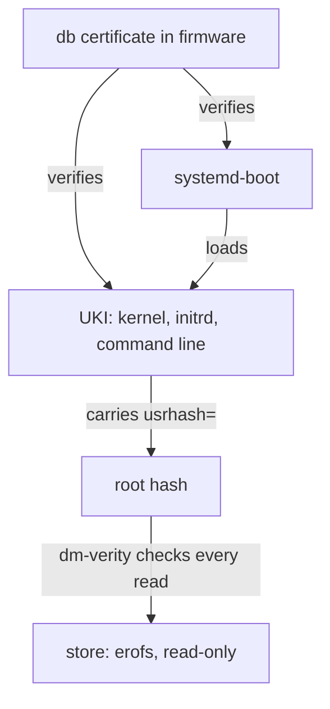

# Security model

chalkos protects three things: the code a node boots, the secrets a node keeps on its disks, and
the API through which a node is installed and operated. Secure Boot and dm-verity cover the code,
the TPM covers the disks, and mutual TLS with the cluster's own certificate authority covers the
API.

## What does a node trust?

A node's trust rests on four anchors:

| Anchor | Where it lives | What it vouches for |
| --- | --- | --- |
| The db signing certificate | The firmware's [db](../reference/glossary.md#db-and-dbx) | The boot loader and the [UKI](../reference/glossary.md#uki), and through the UKI the whole [store](../reference/glossary.md#store) |
| The [OS CA](../reference/glossary.md#os-ca) | The [secrets file](../reference/glossary.md#secrets-file); its certificate is in every image | Every node certificate and client certificate of the node API |
| The Kubernetes, front-proxy and etcd CAs | The secrets file; a [control plane](../reference/glossary.md#control-plane) holds them in its [Kubernetes share](../reference/glossary.md#kubernetes-share) | The control plane's certificates, the kubelets' and admin kubeconfigs |
| The [TPM](../reference/glossary.md#tpm) | The machine | That the node booted under the same Secure Boot state it was installed under |

The db key and the OS CA's key never reach a node. Control planes hold the Kubernetes CAs' keys,
with which they issue their own certificates, and the [node CA](../reference/glossary.md#node-ca),
an intermediate of the OS CA that may issue only node certificates. The
[Certificates](certificates.md) page lists every certificate these anchors issue.

## How does Secure Boot cover the whole image?

[Secure Boot](../reference/glossary.md#secure-boot) makes the firmware refuse a boot binary that
no certificate in db signed. chalkos signs two binaries per image, systemd-boot and the UKI, and
the UKI's signature reaches every file of the store through one hash on its kernel command line.

The diagram shows the chain from the firmware's db down to a block of the store.



The store is an erofs file system on [dm-verity](../reference/glossary.md#dm-verity): every
block read from it is hashed and checked against a hash tree, and a block that does not match
fails to read. The top of that tree, the [root hash](../reference/glossary.md#root-hash), is on
the UKI's command line as `usrhash=`. The UKI is signed, so changing one byte of the store
requires a new root hash, which requires a new UKI, which requires the db key. The kernel modules
live in the store too, so they need no signatures of their own.

Images are built unsigned by Nix and signed afterwards, on the operator's machine, with
[`chalkctl sign`](../reference/cli/chalkctl_sign.md) or with `--sign-key` and `--sign-cert` on
[`chalkctl install`](../reference/cli/chalkctl_install.md) and
[`chalkctl upgrade`](../reference/cli/chalkctl_upgrade.md). Keeping the key out of the build
keeps it out of the Nix store, which any user of the build machine can read, and out of every
binary cache the store is pushed to. Nodes never hold the db key and never sign anything.

Before a node writes an image's UKI or boot loader, [chalkd](../reference/glossary.md#chalkd)
checks its signature against the firmware's db and dbx as the firmware will at the next boot,
when Secure Boot is enforced. It refuses a binary that no db certificate signed, one whose digest
or any certificate of its signature dbx lists, and any binary at all while dbx holds an entry it
cannot read. A node therefore never reboots into an image its firmware would refuse. When the
[cluster definition](../reference/glossary.md#cluster-definition) sets
[`chalkos.secureBoot.signerCertificate`](../reference/options.md#chalkossecurebootsignercertificate),
chalkctl also refuses to upgrade with an image this certificate's key did not sign. The
[signing guide](../guides/secure-boot-signing.md) creates the key and enrols it.

## What does Secure Boot do for upgrades?

Secure Boot limits what the [operator](../reference/glossary.md#operator) role can install to
images the db key's holder signed. The [Upgrade](../reference/api.md#method-upgrade) method checks that an image belongs to the
node's cluster, role and platform and that its UKI boots the store it carries. It cannot tell an
image the cluster's owners built from one somebody else built. Without Secure Boot, anyone with
an operator certificate can install an image of their own and run it as root, with STATE and VAR
unlocked, because their keys are sealed to PCR 7 alone. With Secure Boot enforced, the firmware
boots only images signed with the db key, so an operator can roll out only what the key holder
signed.

## Why are the disk keys sealed to PCR 7?

[STATE](../reference/glossary.md#state), [VAR](../reference/glossary.md#var) and encrypted
[volumes](../reference/glossary.md#volume) are LUKS2 volumes whose key the TPM seals to
[PCR 7](../reference/glossary.md#pcr-7) under the default
[encryption mode](../reference/options.md#chalkosnodesstorageencryptionmode) `tpm2`; the mode
`none` leaves them unencrypted. PCR 7 measures the Secure Boot state: whether it is on, the
contents of PK, KEK, db and dbx, and the db certificate that verified the boot binaries. The TPM
releases the key only when PCR 7 holds the value it was sealed under.

PCR 7 is chosen over the PCRs that measure the kernel and initrd because an
[upgrade](../reference/glossary.md#upgrade) changes those with every image, while an image signed
with the same db key leaves PCR 7 as it was. Upgrades therefore unlock without anyone typing a
key. The consequences:

- A machine that boots with Secure Boot off, or with a different db, KEK or dbx, measures a
  different PCR 7, and the TPM does not unseal. This includes a firmware update that adds dbx
  entries.
- A disk moved to another machine does not unlock there, because the other TPM does not hold the
  sealed key.
- Any boot whose binaries the same db certificate signed measures the same PCR 7, older chalkos
  images included.

When the TPM does not unseal, the console asks for the second keyslot of each volume: the node's
[recovery key](../reference/glossary.md#recovery-key) by default, or a password. The recovery key
is derived from a secret in the secrets file, the cluster's name and the node's name, so no file
stores it and installing a node never changes the secrets file.
[`chalkctl recovery-key`](../reference/cli/chalkctl_recovery-key.md) prints it:

```sh
chalkctl recovery-key <node>
```

[Storage and encryption](storage.md) describes the keyslots and what happens on a node whose
fallback is `none`.

## Who may call the node API?

chalkd serves the [node API](../reference/api.md) on TCP port 50000 with TLS 1.3. On an installed
node, in [normal mode](../reference/glossary.md#normal-mode), it serves its
[node certificate](../reference/glossary.md#node-certificate) and accepts only clients whose
certificate chains to an OS CA the node trusts. It verifies the client's chain again for every
request, against the OS CAs it trusts at that moment, so a client whose certificate expired or
whose OS CA was removed by a [rotation](../reference/glossary.md#rotation) loses access on its
next call, even on a connection it keeps open.

A client's [role](../reference/glossary.md#client-role) comes from its certificate. A
certificate the OS CA issued directly grants the role its Organization names. A certificate whose
chain passes through the node CA has the role `node`, whatever its Organization says, because the
node CA is the only intermediate the OS CA issues; this keeps a control plane, which holds the
node CA, from issuing itself an admin certificate.

| Role | May call |
| --- | --- |
| [reader](../reference/glossary.md#reader) | Info, Disks, Status, Logs, EtcdMembers |
| [operator](../reference/glossary.md#operator) | What a reader may, and Reboot, Upgrade, DrainNode, UncordonNode |
| [admin](../reference/glossary.md#admin) | Every method except RenewNodeCertificate: also Install, ApplyIdentity, ResetVolume, Bootstrap, EtcdRemoveMember, EtcdLeave, RotationStep |
| `node` | RenewNodeCertificate alone, on control planes |

Each role allows what the roles above it in the table allow; `node` is apart and allows only its
one method. A call the role does not allow fails with a message naming the role it needs, such as
`/chalkos.node.v1.NodeService/Reboot needs the operator role`.

## Where do clients get their certificates?

chalkctl authenticates with one of two credentials.

The secrets file holds every CA key of the cluster. A command that reads it issues itself an admin
certificate from the OS CA, valid for one hour and never written to disk, so using the secrets
file leaves no admin certificate behind. The file is `secrets.age`, encrypted with age to the recipients given
to [`chalkctl gen secrets`](../reference/cli/chalkctl_gen_secrets.md) (age keys, SSH keys or age
plugin recipients such as hardware tokens), or `secrets.json` in plaintext with `--plaintext`, for
a file protected by other means. `--secrets -` reads it from standard input, for example from a
password manager, so a plaintext copy never touches the disk:

```sh
chalkctl gen secrets --recipient=<age-public-key>
```

A [client file](../reference/glossary.md#client-file) holds one certificate of one role, its key,
the OS CA certificates and the nodes' addresses. It lets someone operate the cluster without the
secrets file, limited to the role.
[`chalkctl config new`](../reference/cli/chalkctl_config_new.md) issues it, valid for one year
unless `--ttl` says otherwise, and writes it to `~/.config/chalkos/config` with mode 0600:

```sh
chalkctl config new --name=grafana --role=reader --ttl=720h --out=grafana.json
```

Commands that accept both take the client file `--config` names, else the secrets file `--secrets`
names, else the client file `$CHALKOSCONFIG` names, else a secrets file in the flake directory,
else `~/.config/chalkos/config`. chalkctl refuses a client file whose certificate expired and
warns during its last 30 days. Installing nodes, delivering [identities](../reference/glossary.md#identity), issuing kubeconfigs and
rotations need the secrets file, because they issue certificates or deliver keys.

## How is a node in maintenance mode trusted?

A node that is not installed runs chalkd in [maintenance mode](../reference/glossary.md#maintenance-mode).
It has no node certificate yet, so it serves a self-signed one and prints the certificate's
SHA-256 fingerprint and the node's addresses on its console. chalkctl verifies the node in one of
two ways:

```sh
chalkctl install <node> --fingerprint=<fingerprint>
chalkctl install <node> --insecure
```

With `--fingerprint`, chalkctl compares the certificate with the fingerprint read off the
console before it sends anything. With `--insecure`, it accepts whatever certificate the node
presents and prints its fingerprint, which the operator compares with the console afterwards: trust
on first use. chalkctl then opens a second connection pinned to that fingerprint and sends the
secrets over it, so the identity, the node certificate and the Kubernetes share go to the machine
whose fingerprint was printed. Every command that reaches a node in maintenance mode accepts
`--insecure`.

The node in turn decides whom it accepts. An image built with
[`chalkos.cluster.osCA`](../reference/options.md#chalkosclusterosca), a role image or the
cluster's [installer](../reference/glossary.md#installer), accepts in maintenance mode only
clients with a certificate of that OS CA, so only the holder of the secrets file or a client file
can install it. An image built without one accepts any client as an admin until it is installed.
Use images with the OS CA on any network other people can reach.

## Can anyone log in to a node?

No. Nodes have no SSH server, no passwords and no interactive accounts. The root file system is a
tmpfs assembled at boot, `/etc` is a read-only overlay built from the image, and the store is
read-only and checked by dm-verity, so a node changes only through chalkd. Logs come through
[`chalkctl logs`](../reference/cli/chalkctl_logs.md). A node with Kubernetes is debugged from a
privileged pod, started with `kubectl debug node/<node>`, which sees the node's file systems;
[`chalkos.debug.tools`](../reference/options.md#chalkosdebugtools) adds the usual command-line
tools to an image for that.

## Limits

- chalkos does not enrol Secure Boot keys. The operator enrols the db certificate in each machine's
  firmware, as the [signing guide](../guides/secure-boot-signing.md) shows; only [chalklab](../reference/glossary.md#chalklab) enrols
  keys, its own, in its virtual machines. The options
  [`chalkos.secureBoot.enrollment`](../reference/options.md#chalkossecurebootenrollment) and
  [`chalkos.secureBoot.require`](../reference/options.md#chalkossecurebootrequire) are declared,
  but nothing reads them yet, and installing does not check that Secure Boot is on.
- There is no certificate revocation list. A leaked client file or kubeconfig stays valid until it
  expires or its CA is rotated; rotation is how access is revoked, as
  [Certificates](certificates.md) explains.
- The TPM unseals without a PIN for every boot under the same Secure Boot state, so a machine
  decrypts its own disks whenever it boots. chalkos does not defend against an attacker with the
  machine in hand who attacks it while it runs, for example through its memory.
- PCR 7 does not tell one image signed with the db key from another. An older signed image with a
  known flaw unseals the keys too, until its signature or the key is revoked through dbx.
- The approver of kubelet serving certificates checks a request against the addresses the Node
  object lists. A kubelet reports those addresses itself, so the check stops a node from claiming
  another node's name, not from claiming an address it does not own.
- A node's clock decides whether certificates are valid. A node whose clock is far off refuses
  valid certificates and accepts expired ones until chrony sets it.

## Related pages

- [Certificates](certificates.md): every CA and certificate, renewal, rotation and revocation.
- [Storage and encryption](storage.md): the encrypted volumes and their keyslots.
- [The image](image.md): the store, dm-verity and the UKI.
- [Sign images for Secure Boot](../guides/secure-boot-signing.md).
- [Rotate certificates and CAs](../guides/rotate-certificates.md).
- [Node API](../reference/api.md), [`chalkctl config new`](../reference/cli/chalkctl_config_new.md)
  and [`chalkctl gen secrets`](../reference/cli/chalkctl_gen_secrets.md).
