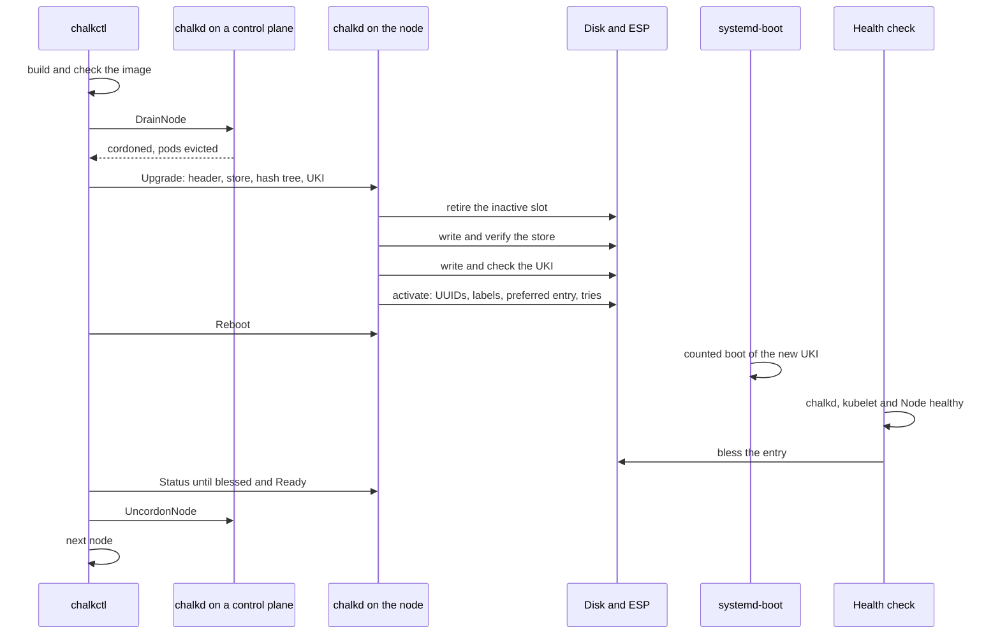

# Upgrades

An [upgrade](../reference/glossary.md#upgrade) installs a new [image](../reference/glossary.md#image)
version on a node: the operating system, Kubernetes and [chalkd](../reference/glossary.md#chalkd)
together. chalkd writes the image into the node's inactive [slot](../reference/glossary.md#slot),
and the node boots it with a fixed number of tries; an image that does not become healthy is
replaced by the one before.
[`chalkctl upgrade`](../reference/cli/chalkctl_upgrade.md) rolls the upgrade through a cluster
node by node, so the cluster keeps its etcd quorum and its workloads keep running.

## What is an upgrade?

An upgrade replaces the whole image with a new [image version](../reference/glossary.md#image-version).
There are no packages to update on a node and no separate Kubernetes upgrade: a new Kubernetes
release is a new image built with a new
[`chalkos.cluster.kubernetes.package`](../reference/options.md#chalkosclusterkubernetespackage),
installed like any other.

The node receives three parts of the image, in this order:

- the [store](../reference/glossary.md#store)'s data, the compressed erofs file system that the
  [root hash](../reference/glossary.md#root-hash) covers, about 250 MiB for a Kubernetes role;
- the store's [dm-verity](../reference/glossary.md#dm-verity) hash tree, about 2 MiB;
- the [UKI](../reference/glossary.md#uki), about 44 MiB, signed for
  [Secure Boot](../reference/glossary.md#secure-boot).

An upgrade never sends a boot loader, and the node refuses one: systemd-boot stays as it was
installed. The parts are the ones an install sends, read from the same image, so a node installed
from an image and one upgraded to it run the same bytes.

The node keeps no upgrade state of its own. The slots' partition UUIDs and labels and the UKIs on
the [ESP](../reference/glossary.md#esp) say what is installed, and the cluster's versions and
cordons say how far a rolling upgrade got. So any step can stop at any point, and running the
same command again continues.

## Where does chalkctl get the images?

Without `--image`, chalkctl asks every node what it runs, groups the nodes by role and platform
and builds one image per group from the flake with `nix build` of
`chalkos.<cluster>.roles.<role>.images.<platform>`:

```sh
chalkctl upgrade
```

With `--image`, it takes a prebuilt image, a raw image with `repart-output.json` beside it or the
directory `nix build` makes, and installs it on the nodes of the image's role and platform. Nodes
of that role on another platform are skipped and named.

```sh
chalkctl upgrade --image=<image-dir> --max-unavailable=2
```

`<image-dir>` is the directory `nix build` produced. In both cases, `--sign-key` and `--sign-cert`
sign the UKI before it is sent, so the signing key never enters the Nix store.

Before it sends anything, chalkctl checks each image against the cluster:

- the UKI boots the store the image holds: its `usrhash=` equals the store's root hash;
- the version is one chalkos installs, and the UKI's os-release names a cluster, role and
  platform;
- the cluster is this cluster;
- the UKI carries a signature of the certificate in
  [`chalkos.secureBoot.signerCertificate`](../reference/options.md#chalkossecurebootsignercertificate),
  or, when that is not set, of the certificate chalkctl signed with.

chalkctl also stops before any image is built or sent when a node runs another role or platform
than the [cluster definition](../reference/glossary.md#cluster-definition) declares for it, because changing either is a reinstall.

## What does the node check?

The [Upgrade](../reference/api.md#method-upgrade) method needs the
[operator](../reference/glossary.md#operator) role and
[normal mode](../reference/glossary.md#normal-mode). Before it changes anything,
chalkd checks the image's header against the running image's os-release and the disk:

- the image ID, cluster, role and platform equal the running image's, and the architecture the
  machine's;
- the version is not the running one, unless the root hash is the same too, in which case the node
  answers that it runs the image already and changes nothing;
- no UKI on the ESP holds the version with another root hash, and no UKI that stays would collide
  with the new entry's name;
- the running boot was found healthy, when the upgrade would remove the image the node falls back
  to;
- the store and hash tree fit the inactive slot.

The UKI is checked when it arrives, before anything can boot it. Its SHA-256 must match the
header, its os-release must name the same image ID, version, cluster, role and platform as the
header, its `usrhash=` must equal the header's root hash, and its boot tries must be a positive
number. With Secure Boot enforced, chalkd checks its signature against the firmware's
[db and dbx](../reference/glossary.md#db-and-dbx) as the firmware will, and refuses it when dbx
lists its digest or any certificate in its signer's chain.

## How does a node install the image?

chalkd installs in four steps. At every point between them the disk boots the running image, or
the new one with all its tries.

1. Retire the inactive slot. chalkd removes every UKI of the image on the ESP except those that
   boot the running store, including a UKI a stopped upgrade left under its temporary name. Then it
   gives the slot's partitions random UUIDs and the label `_empty`, so nothing can boot them.
2. Write and verify. chalkd writes the store and hash tree into the slot, checks their SHA-256
   sums and verifies the store read back from the disk against the root hash. A slot that already
   holds this store is not written again.
3. Receive the UKI. chalkd writes it to the ESP as `/EFI/Linux/.upgrade-<version>.efi`, a name
   systemd-boot ignores, and checks it.
4. Activate. chalkd gives the slot the partition UUIDs derived from the root hash and the labels
   `store_<version>` and `store-verity_<version>`, sets `LoaderEntryPreferred` to the new entry
   and renames the UKI to `chalkos_<version>+<tries>.efi`. The rename is the last change: before
   it, nothing boots the slot.

The running slot and its UKI are never written. Once the client stops sending, chalkd stops
between steps, never in the middle of a partition table change.

[Boot, health and rollback](boot-and-rollback.md) explains what happens at the next boot: the
counted tries, the [health check](../reference/glossary.md#health-check), the
[blessed boot](../reference/glossary.md#blessed-boot) and the fallback.

## How does an upgrade roll through a cluster?

`chalkctl upgrade` upgrades the [control planes](../reference/glossary.md#control-plane) first,
one at a time, then the [workers](../reference/glossary.md#worker) and nodes without Kubernetes in
batches of `--max-unavailable`, 1 by default. Control planes go first across every role and
platform, which also keeps every kubelet at or behind its API server's version, as Kubernetes
requires.

For each node, chalkctl:

1. reads what the node runs and its boot status;
2. on a control plane, checks that etcd keeps its quorum while the node reboots;
3. on a worker, drains the node;
4. streams the image, unless the node has it installed already;
5. on a control plane, drains the node;
6. reboots the node;
7. waits until the node runs the new version, its boot was found healthy and its Node is Ready;
8. uncordons the node, if the upgrade cordoned it.

The sequence shows a worker's upgrade.



A run over a cluster of three control planes prints this, shortened. On cp1 a pod without a
controller, `default/debug`, stays where it is:

```text
upgrading controlplane on metal to chalkos 1.5.0: cp1, cp2, cp3
cp1: installing 1.5.0
cp1: installed 1.5.0, which boots next as chalkos_1.5.0+3.efi
cp1: cordoned, evicted 2 pods, kept 7
cp1: keeps pods without a controller: default/debug; nothing starts them elsewhere, and they are deleted for good if the node stays down longer than their tolerations allow
cp1: rebooting into 1.5.0
cp1: runs 1.5.0, found healthy
cp1: uncordoned
cp2: installing 1.5.0
...
upgraded 3 nodes to 1.5.0
```

### Why must etcd keep its quorum?

etcd needs a majority of its voting members to answer, and the API server needs etcd. Before a
control plane that is an [etcd member](../reference/glossary.md#etcd-member) reboots, chalkctl
asks for etcd's members through a control plane and requires that the other voters are healthy and
still a majority of all voters. A learner refuses the check until it has joined as a voter. etcd
may need a moment after the previous control plane came back, so the check is retried for up to a
minute.

With one or two control planes, the others can never be a majority: etcd and the API server are
down while one reboots. chalkctl refuses that unless `--allow-downtime` accepts it. A lab's single
control plane always needs the flag.

### How are nodes drained?

Drains run on a control plane's chalkd, through the [DrainNode](../reference/api.md#method-drainnode)
method, because an operator's client file carries no Kubernetes credentials. chalkd cordons the
node, marks it with the annotation `chalkos.dev/upgrade-cordon` and evicts its pods through the
eviction API, so PodDisruptionBudgets hold. It keeps DaemonSet pods, mirror pods, finished pods and
pods without a controller, which nothing would start elsewhere; chalkctl names those. Pods with
emptyDir volumes are evicted only with `--delete-emptydir-data`, which deletes their data. A drain
that does not finish within `--timeout`, 30 minutes by default, stops the run and leaves the node
cordoned.

A worker is drained before its image is sent. A control plane gets its image first and is drained
right before it reboots.

## What stops a run?

A run stops at the first node that fails, and leaves the rest as they are. The most important case
is a [rollback](../reference/glossary.md#rollback): a node that fell back from the new image. The
error names the node and the version it runs again, and the journal lines its failed boot
recorded follow it:

```text
chalkctl: w2: upgrade to 1.5.0 failed: rolled back to 1.4.0; it stays cordoned; its boots logged:
```

The node stays cordoned for an operator to look at.

A run also stops when a drain times out, when a control plane would take etcd's quorum with it or
when a node does not come back healthy and Ready within `--timeout`.

## What happens when the command runs again?

Running the same command again continues where the last run stopped:

- a node that runs the new version with a blessed boot is skipped, or only uncordoned once its
  Node is Ready;
- a node that booted the new version and is still being counted is waited for;
- a node that has the image installed already is rebooted without sending the image again;
- a node is uncordoned only if the annotation `chalkos.dev/upgrade-cordon` shows the upgrade
  cordoned it, so a node an operator cordoned stays cordoned.

A node that fell back from the version stops every later run too, so a known-bad image is never
booted again by itself. `--retry-failed` installs it once more on such nodes, for a failure that
lay outside the image; each node is upgraded once per run, so a second fallback stops the run
again. Usually the fix is a new build, which needs a new version.

## Which flags change a run?

| Flag | Effect |
| --- | --- |
| `--image` | Install a prebuilt image on the nodes of its role and platform, instead of building each group's image |
| `--nodes` | Upgrade only the named nodes |
| `--max-unavailable` | Upgrade this many workers and nodes without Kubernetes at once, 1 by default |
| `--allow-downtime` | Upgrade one or two control planes, whose etcd and API server are down while one reboots |
| `--no-reboot` | Install on every node without draining or rebooting; each boots the new image at its next reboot |
| `--retry-failed` | Install an image again, once, on nodes that fell back from it |
| `--delete-emptydir-data` | Evict pods with emptyDir volumes too, deleting their data |
| `--timeout` | How long a drain and a node's return may take, 30 minutes by default |

The command needs an operator [client file](../reference/glossary.md#client-file) or the
[secrets file](../reference/glossary.md#secrets-file). A [lab](../reference/glossary.md#lab),
for example, is upgraded with its client file and its Secure Boot keys, which
[`chalklab status`](../reference/cli/chalklab_status.md) names:

```sh
chalkctl upgrade --config=<client-file> --sign-key=<db-key> --sign-cert=<db-cert> \
  --allow-downtime
```

## Can a node go back to an older version?

Yes. A downgrade is an upgrade to an image with a lower version, and chalkd accepts it like any
other. systemd-boot would boot the newest version on the ESP by default, so activation sets
`LoaderEntryPreferred` to the new entry, which makes the older version boot; when its tries are
used up, systemd-boot passes over it and the fallback works as for any upgrade. A version whose UKI
is still on the node's ESP with another root hash is refused, as for any upgrade.

## What does an upgrade trust?

chalkd checks that an image is of its cluster, role and platform and boots the store it carries;
it cannot tell an image to trust from another. Secure Boot does that. With Secure Boot enforced,
the node refuses a UKI that the firmware's db does not accept, so only images signed by a trusted
signer run. Without Secure Boot, an operator can upgrade a node to any image, which then runs as
root with [STATE](../reference/glossary.md#state) and [VAR](../reference/glossary.md#var)
unsealed, because their keys are sealed to [PCR 7](../reference/glossary.md#pcr-7) alone.
[Security model](security.md) explains the consequences.

After a [rotation](../reference/glossary.md#rotation) of the [OS CA](../reference/glossary.md#os-ca), images rebuilt from the new
`secrets.pub.json` and rolled out with `chalkctl upgrade` bring the trust of
[maintenance mode](../reference/glossary.md#maintenance-mode) up to date, for nodes that are
installed again later.

## Limits

- Every node receives the whole compressed store, about 300 MiB with the hash tree and UKI. There
  are no delta updates, and nodes do not share a download.
- Images travel only through chalkctl's stream. Nodes do not pull images from a registry.
- An upgrade never updates systemd-boot.
- chalkctl does not check Kubernetes's
  [version skew policy](https://kubernetes.io/releases/version-skew-policy/) beyond upgrading
  control planes first. An image that skips a Kubernetes minor version is not refused.
- The health check decides on chalkd, etcd, the API server and the kubelet. An image that breaks
  only workloads is blessed, and the run continues.
- A cluster with one or two control planes has no API server while a control plane reboots.

## Related pages

- [Boot, health and rollback](boot-and-rollback.md) for [boot counting](../reference/glossary.md#boot-counting) and the health check.
- [The image](image.md) for what an image holds and how versions are named.
- [Kubernetes on chalkos](kubernetes.md) for etcd membership and the control plane.
- [Upgrade a cluster](../guides/upgrade-cluster.md) for the task, step by step.
- [`chalkctl upgrade`](../reference/cli/chalkctl_upgrade.md) and the
  [Upgrade](../reference/api.md#method-upgrade) method for the details.
