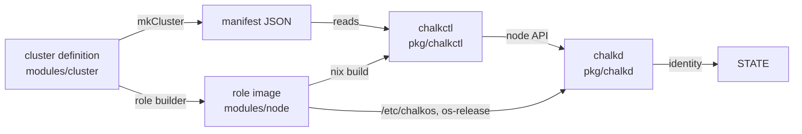

# Architecture for developers

chalkos is two halves: Nix modules that declare a cluster and build its images, and Go programs
that install and operate the nodes. This page maps both to the repository and shows where they
meet. [Architecture](../concepts/architecture.md) explains the system as a user sees it; this
page is for changing it.

## Where do Nix and Go meet?

Go code never evaluates Nix itself. The [cluster definition](../reference/glossary.md#cluster-definition) reaches it as JSON, in three forms:

- The [manifest](../reference/glossary.md#manifest), which `mkCluster` generates as
  `chalkos.<cluster>.manifest`: the cluster's settings, the roles' image paths and every node's
  [identity](../reference/glossary.md#identity). chalkctl and [chalklab](../reference/glossary.md#chalklab) read the cluster through
  it alone, decoded by `pkg/manifest`.
- A node's identity, the manifest's entry for that node, which chalkctl delivers to [chalkd](../reference/glossary.md#chalkd) and
  chalkd keeps on [STATE](../reference/glossary.md#state).
- Files the [role](../reference/glossary.md#role) image carries in `/etc/chalkos`, written by
  the node modules: the cluster's Kubernetes settings in `kubernetes/cluster.json`, the
  manifests chalkd applies in `kubernetes/manifests.json`, the system region's repart
  definitions in `repart.d` and the [OS CA](../reference/glossary.md#os-ca) certificate in
  `os-ca.crt`; and the image's own description in `/etc/os-release`.

The diagram follows a cluster definition to a running node.



## Programs in cmd

Each directory of `cmd/` is a main that wires a package up; the logic lives in `pkg/`.

| Program | What its main does |
| --- | --- |
| `cmd/chalkctl` | Runs `chalkctl.NewCommand()` with a context that Ctrl+C cancels. |
| `cmd/chalklab` | The same for `chalklab.NewCommand()`. |
| `cmd/chalkd` | Dispatches the four commands the node's units run: `serve` (chalkd.service), `load-identity` (chalkos-identity.service), `prepare-kubernetes` (chalkos-kubernetes.service) and `health` (chalkos-health.service), and loads the credentials `serve` starts with. |
| `cmd/chalkos-storage` | Opens STATE and sets up the volumes in the initrd, and runs as a systemd generator for the other volumes. |
| `cmd/docgen` | Writes the command reference and checks the commands the documentation shows. |

## Packages in pkg

| Package | What it does |
| --- | --- |
| `api/node/v1` | The node API's messages and Connect client and server, generated by `buf generate`. |
| `chalkctl` | The chalkctl command tree. |
| `chalkd` | The node API server, with the permissions of each method, and chalkd's work at boot: renewals, the [VIP](../reference/glossary.md#vip) election, the [health check](../reference/glossary.md#health-check). |
| `chalklab` | The chalklab command tree and the [lab](../reference/glossary.md#lab)'s supervisor. |
| `client` | Connections to chalkd: by fingerprint in [maintenance mode](../reference/glossary.md#maintenance-mode), by the OS CA otherwise. |
| `identity` | Applies an identity on the node: `/run/chalkos/node.json`, credential files, networkd units, chrony's servers and the hostname. |
| `image` | Reads the partitions of a raw image from `repart-output.json`. |
| `imagesign` | Signs an image's boot loader and UKIs, and copies them off the image. |
| `install` | Installs a node in place or from the [installer](../reference/glossary.md#installer), step by step and repeatable. |
| `kubernetes` | The node's Kubernetes cluster as the image records it, and the node as its identity names it. |
| `kubernetes/apply` | Server-side apply of manifests and approval of kubelet serving certificates. |
| `kubernetes/etcd` | etcd membership: learners, promotion, quorum-safe removal. |
| `kubernetes/manifests` | The [control plane](../reference/glossary.md#control-plane)'s static pods. |
| `kubernetes/node` | The node's Kubernetes files at boot: addresses, kubelet credentials and flags, control-plane certificates. |
| `kubernetes/nodeip` | Picks the node's address of each family. |
| `kubernetes/pki` | The Kubernetes certificates: the share, the control plane's leaves, admin kubeconfigs. |
| `kubernetes/vip` | Adds a VIP to an interface and announces it. |
| `lab` | QEMU VMs, swtpm, the lab switch and console, for chalklab and the end-to-end tests. |
| `manifest` | The manifest's Go types. |
| `pki` | The [secrets file](../reference/glossary.md#secrets-file), the OS CA and [node CA](../reference/glossary.md#node-ca), client and [node certificates](../reference/glossary.md#node-certificate), client roles. |
| `storage` | Storage sections, disk references and pins, repart definitions, change classification. |
| `storage/node` | Storage on the node: STATE, [volumes](../reference/glossary.md#volume), [VAR](../reference/glossary.md#var) and the generator's units. |
| `uki` | Reads a [UKI](../reference/glossary.md#uki)'s os-release and command line, and checks its signature as firmware does. |
| `upgrade` | Writes an image into the inactive [slot](../reference/glossary.md#slot) and makes it the next boot; the slot writer install shares. |
| `verity` | Reads and checks [dm-verity](../reference/glossary.md#dm-verity) hash trees. |

`uki/ukitest` and `kubernetes/etcd/etcdtest` hold test helpers: small UKIs and in-process etcd
members.

## The node API

The API is defined in `api/chalkos/node/v1/node.proto` and served by chalkd over Connect on
TCP port 50000 with mutual TLS. Which [client role](../reference/glossary.md#client-role) may
call a method, and in which mode, is one table: `permissions` in `pkg/chalkd/server.go`.

```go
nodev1connect.NodeServiceInfoProcedure:    {[]nodev1.Mode{maintenance, normal}, pki.RoleReader},
nodev1connect.NodeServiceInstallProcedure: {[]nodev1.Mode{maintenance}, pki.RoleAdmin},
nodev1connect.NodeServiceUpgradeProcedure: {[]nodev1.Mode{normal}, pki.RoleOperator},
```

A new method needs an entry there; the authoriser refuses a method without one. Comments in the
proto file become the [Node API](../reference/api.md) page, so they are written for users.

## The command-line programs

chalkctl and chalklab are cobra command trees in importable packages: `pkg/chalkctl` and
`pkg/chalklab` each export `NewCommand()`, which returns the root command, and
`Execute(ctx, root)`, which runs it and returns the exit code. Another program can add their
trees to its own, and tests run commands in-process with their output captured. Each package
keeps its help texts in `help.go`, and a test requires a short and a long description and an
example on every visible command, because they become the
[command reference](../reference/cli/index.md).

## Nix modules

| Directory | What it holds |
| --- | --- |
| `modules/cluster/options/` | The core options of a cluster definition, the role builder (`roles.nix`) and the manifest (`manifest.nix`). |
| `modules/cluster/features/` | Built-in features, one directory each: `cni` (flannel) and `dns` (CoreDNS). |
| `modules/cluster/kubernetes/` | The Kubernetes objects every cluster gets: RBAC and kube-proxy. |
| `modules/cluster/storage.nix`, `time.nix`, `settings.nix` | Rendering of storage sections into identities, the type of a time server, and the cluster settings role images read. |
| `modules/node/` | The NixOS modules of every role image: `base/` (appliance, closure, disk, storage), `runtime/` (`chalkos.node.*`), kernel, chalkd, time, Kubernetes, upgrade, the VXLAN rule. |
| `modules/platforms/` | `metal` and `kvm`. |
| `modules/installer/` | The installer image and its ISO. |
| `modules/testing/` | The test probe and the test image's partition sizes. |
| `lib/` | `mkCluster` and the flake-parts module. |

## Layout rules

The layout follows these rules, so each change has one place to go:

- A feature directory is self-contained: its options, its cluster configuration and what it
  contributes to roles, together. chalkos's own features use the mechanism an
  [extension](../reference/glossary.md#extension) uses.
- Core options are declared in `modules/cluster/options/`; node modules declare only the
  options of a role image.
- Go code reads the cluster definition through the manifest, the identity and the image's files
  alone.
- `nix/` holds tooling: packages, apps, checks, the development shell, the docs build and test
  fixtures, not product logic.
- `cmd/` holds the mains, which wire packages up; logic worth testing lives in `pkg/`.

[Development setup](development.md) lists the commands of a development loop and
[Testing](testing.md) the tests each part has.
