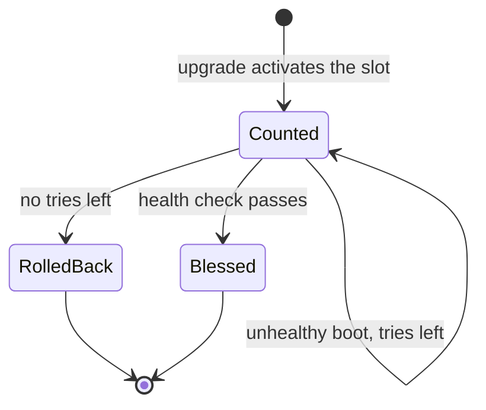

# Style guide

<!--
Scope: The rules every hand-written page follows, with examples, the page templates and the
checklist a writer runs before handing a page in. The generated reference pages follow the
voice rules through their sources: command help, option descriptions and proto comments.
-->

This guide holds the rules every hand-written page of the chalkos documentation follows. Each
rule has a reason, so a case the guide does not cover can be decided the same way. The
generated reference pages are written in their sources (command help in `pkg/chalkctl/help.go`
and `pkg/chalklab/help.go`, option descriptions in `modules/`, comments in
`api/chalkos/node/v1/node.proto`), and the voice and word rules apply there too.

## Who reads these pages?

The reader is a working engineer who knows Linux, Kubernetes and some Nix, and has not met
chalkos. They want to understand a mechanism well enough to trust it, or to finish a task
without guessing. Explain chalkos; assume general fluency. A reader who has never written a Nix
module can still follow a guide, because guides show every file they ask the reader to write.

## Voice

Write as a senior engineer explaining something to a capable colleague: lead with the point,
give the mechanism, name the trade-off, then stop.

- Lead with the point. The first sentence of a page, a section or a paragraph states the claim,
  the definition or the problem it solves. Qualifications follow in the next sentence.
- Give the mechanism. Say how something works, and chain a fact to its consequence with "so" or
  "because".
- Name the trade-off and its real effect: "adds a reboot per node", "costs 2 MiB per upgrade",
  "the cluster has no API server while the control plane reboots". Name the metric, not a
  metaphor for it: write latency, transfer size, memory, downtime.
- Give a verdict when the engineering supports one, and bound the exception: "Use three control
  planes. A single one is fine for a lab, where API downtime during an upgrade does not matter."
- Stop. A section ends when its point is made; it needs no summary sentence.

Before:

> chalkos leverages the power of dm-verity to provide robust protection against tampering —
> every single block, every single time.

After:

> dm-verity checks every block of the store against a hash tree when it is read, so a modified
> block fails to read. The tree's root hash is on the UKI's command line, which Secure Boot
> verifies, so the firmware's signature check covers the whole store.

The second version names the mechanism, the consequence and what makes it trustworthy, in calm
sentences.

### Terms

- Define a term before an argument depends on it. A short clause on the same line is enough:
  "STATE, the small encrypted partition that holds the node's identity, ...".
- Use the precise term and keep it. A slot stays a slot for the whole page; it does not become a
  "partition set" in the next paragraph. The [glossary](../reference/glossary.md) lists the
  terms and their spelling.
- Quote the exact text the reader will see, such as an error message or a status line, and say
  what it means.

### Emphasis

No italics or bold for emphasis. A sentence that needs emphasis needs rewording, or the point
belongs in its own sentence. Italics are for titles of works only. Bold appears in no prose, list
item or table cell; a heading does that job.

## Person and tense

- Tutorials and guides address the reader in the second person and write steps in the
  imperative: "Run `chalklab create`." "Your cluster now has two nodes."
- Concepts and reference pages use the system voice: they describe chalkos, never the reader.
  "chalkd writes the inactive slot", not "you get a new slot".
- No "we" on any page. Write "chalkos" or name the component.
- Present tense, in procedures too: "the node reboots", not "the node will reboot". Pages
  describe what chalkos does today; plans belong on the [roadmap](roadmap.md).
- Chumminess stays out everywhere: no "let's", no "don't worry", no exclamation marks.

## Spelling and names

- British spelling with -ise: customise, initialise, behaviour, licence as a noun. Upstream
  names keep theirs (`Authorization`, `ConditionVirtualization`).
- No serial comma, unless a list item contains "and": "erofs, dm-verity and the UKI".
- chalkos is always lower case, also at the start of a sentence. chalkd, chalkctl and chalklab
  are names in prose; in code font only as part of a command or a path.
- Keep upstream capitalisation: Kubernetes, etcd, containerd, kubelet, systemd, systemd-boot,
  Nix, NixOS, erofs, dm-verity, Secure Boot, TPM, UEFI, Proxmox, libvirt, QEMU.
- chalkos's own terms: STATE and VAR in capitals, A/B, UKI, OS CA, node CA, db and dbx, PCR 7.
- Sizes in binary units with a space: 128 MiB, 3 GiB. Option values keep their own spelling
  (`"128M"`).

## Words to avoid

| Word or phrase | Why | Instead |
| --- | --- | --- |
| simply, just, easily, obviously, of course | They tell the reader a step is easy; a reader who is stuck now feels slow, and the word adds nothing for the others. | Delete the word. |
| leverage, utilise | Inflated synonyms. | use |
| robust, powerful, seamless, effortless, cutting-edge, best-in-class, blazing fast | Marketing words make claims without evidence. | State the property and its evidence: "falls back to the previous image when a new one does not become healthy within 5 minutes". |
| secure, safe (alone) | Says nothing about what is protected from what. | Name the threat and the mechanism. |
| in order to, it should be noted that, it is worth mentioning, please note | Throat-clearing. | Delete; "to" for "in order to". |
| basically, essentially, actually, really, very | Filler that softens or inflates. | Delete. |
| might, could potentially, may possibly (stacked) | Over-hedging hides whether something happens. | Say when it happens: "fails when the disk holds another node's STATE". |
| etc., and so on | Leaves the reader to guess the rest of the list. | Finish the list, or frame it as examples: "for example ...". |
| click here, this link | Link text that does not say where it leads. | Link the name of the target. |
| master, slave, whitelist, blacklist | Upstream projects replaced them. | primary, replica, allow list, deny list |

## AI tells to remove

Drafts written quickly, by people or by models, pick up patterns that make text read as
generated and hide the point. Edit each away.

| Tell | Example | Fix |
| --- | --- | --- |
| Punchy reveal | "Upgrades are slow: a whole image, every node, every time." | State it plainly: "An upgrade sends the image's store, about 250 MiB, to each node." |
| "Not just X but Y" | "chalkos is not just an OS, it is a platform." | Delete the negated half; if the point survives, it never needed it. Keep a "not" only to correct a model the reader is likely to hold, in its own sentence. |
| Em-dash drama | "The node boots — and then the TPM refuses." | Write no em dashes. A colon introduces an explanation, a comma or a new sentence does the rest: "The node boots, and the TPM refuses to unseal STATE." |
| Filler opener | "In today's world of cloud-native infrastructure, ..." "Let's take a look at ..." | Start with the point: "chalkd decides at every boot whether the node is installed." |
| Over-hedging | "This could potentially cause issues in some cases." | Name the case and the effect: "A node without its pinned address does not start etcd." |
| Stacked headings | `## Upgrades` directly followed by `### Overview` | Put at least one paragraph under every heading; drop "Overview" and "Introduction" headings. |
| Rhetorical question | "So what happens when the TPM fails? Let's see." | Answer instead: "When the TPM does not unseal STATE, the console asks for the recovery key." A heading may be a question; prose does not ask one. |
| Forced triad | "fast, safe and simple" | List what is true, however many items that is. |
| One-line closer | "And that's all there is to it." "Simple as that." | Delete. |
| Mystery opening | "Something strange happens on the third boot ..." | State the behaviour in the first sentence. |
| Self-justifying meta | "This analogy holds where it matters." "As mentioned above, ..." | Delete; link the section if the reader needs it. |
| Bold labels in lists | "- **Fast:** the image ..." | Write the item as a sentence, or use a table when items share fields. |

## Headings

- Sentence case, no full stop.
- A heading is a question the reader has or a concrete statement: "What does STATE hold?",
  "Rollback after a failed boot", "Install the first control plane". Avoid labels that say
  nothing about the content: "Overview", "Details", "Miscellaneous", "When things go wrong".
- No parentheses in headings: "Storage on other disks", not "Storage (other disks)".
- No "you" in concept and reference headings. Guide and tutorial step headings are imperative
  and need no pronoun: "Create the secrets".
- No code font in headings. Name the command or option in words, or put it in the first
  sentence under the heading.
- One H1 per page, the same text as the front matter's `title`. Sections are H2, subsections
  H3. Tutorials and guides go no deeper than H3; concepts and reference rarely need H4.
- Every heading has text under it before the next heading. The first sentence under a heading
  delivers information, not a teaser.

## Code blocks

### Which kind of block?

| Content | Fence | Prompt |
| --- | --- | --- |
| A command with its output | `console` | `$ ` before each command; output lines without a prompt |
| Commands without output, to run or copy | `sh` | none |
| A script file | `sh` with `title="name.sh"` | none |
| Output alone, logs, console text | `text` | none |
| Nix, JSON, YAML, TOML | `nix`, `json`, `yaml`, `toml` | none |

````markdown
```console
$ chalkctl status cp1
```

```sh
chalkctl gen secrets --plaintext
chalklab create
```
````

Output must come from a real run. Shorten long output with a line holding only `...`, and never
change what remains. Break a command longer than about 100 characters with ` \` at the end of
the line and indent the continuation by two spaces.

### Every command must exist

`docgen check`, part of the `docs` check, reads every fenced block without a language or in
`sh`, `bash`, `shell`, `zsh`, `console` or `shell-session`, and fails on a `chalkctl` or
`chalklab` command, subcommand or flag that does not exist, on a single-dash long flag and on a
flag missing its value. It strips `$ ` prompts and follows `sudo`, `env`, `nix run ... --` and
`nix develop -c`. Positional arguments and flag values are not checked. A page that shows a
command another way, in prose for example, is not checked, so show commands in blocks.

### Placeholders

A value the reader replaces is a placeholder: lower-case words joined by dashes in angle
brackets, such as `<node>`, `<client-file>` or `<db-key>`. Explain each placeholder in the
sentence before or after the block. Tutorials use the lab's real names (`cp1`, `w1`) instead.

A placeholder that is a flag's value is written with `=`, as in `--fingerprint=<fingerprint>`,
because the shell reads a word starting with `<` as a redirection, and so does `docgen check`:
it would report `--fingerprint` as missing its value.

```sh
chalkctl install <node> --fingerprint=<fingerprint>
chalkctl logs <node> --unit=<unit>
```

### Comments in code

A comment in a block explains a decision the reader would otherwise question, not what the next
line does: `# A single control plane has no API server while it reboots.`

## Admonitions

Admonitions take content out of the flow, so each one has to be worth the interruption. Three
kinds are used:

| Kind | Use it for | Example |
| --- | --- | --- |
| `note` | Context that helps but that the reader can skip without harm. | Where a default comes from; a limit of the current version. |
| `warning` | A step that fails, or costs time or data that can be recovered, when done wrong. | Draining a node evicts its pods. |
| `danger` | Something that cannot be undone: lost data or keys, a node that no longer boots or unlocks, an attacker gaining access. | Losing the secrets file; `--wipe-disk` on the wrong disk. |

```markdown
!!! warning "The node reboots"

    The upgrade drains and reboots one node at a time.
```

- Give a title that states the point, as above; not "Warning" or "Important".
- Never place two admonitions next to each other, and never more than one per screen of text.
  When several things need attention, they are the text.
- Do not use `tip`, `info`, `success` or the other kinds; a tip is text.
- A collapsible block (`???`) holds only long output or a full file the reader may want to see.

## Diagrams

Diagrams are Mermaid, in a `mermaid` fence, so they are text in the repository and follow the
site's light and dark themes.

A diagram earns its place when the reader would otherwise hold more than three or four things
in mind at once: a sequence across several components (install, upgrade), a state machine
(boot counting and rollback), a hierarchy (certificates) or a layout (partitions, networks). A
list of steps, a two-box relation or anything a table shows is text.

````markdown

````

- One idea per diagram, at most about twelve boxes, readable at the content width without
  scrolling.
- Introduce it with a sentence that says what it shows, and make the text understandable without
  it, because a screen reader and a reader of the Markdown source see only the code.
- Labels use the glossary's terms and the same names as the text: `chalkd`, `STATE`, `slot B`.
  Edge labels are short verbs: "writes", "verifies", "boots".
- No colours, classes or styles: the theme colours diagrams for both schemes.
- Use `flowchart` (LR for chains, TD for hierarchies), `sequenceDiagram` and
  `stateDiagram-v2`; other diagram types render less reliably.

## Links

### Between pages

Link with relative paths to the Markdown file, never with site URLs:
`[the image](../concepts/image.md)`, `[slots](image.md#slots)`. The strict build fails on a
link to a page or anchor that does not exist. Link text names the target, never "here".

### The glossary

Link a glossary term on its first use on each page, and only there:
`[STATE](../reference/glossary.md#state)`. The anchor is the one in the glossary heading's
`{ #... }`: the term in lower case with words joined by dashes (`#maintenance-mode`,
`#db-and-dbx`, `#a-b` for A/B). A term the page itself explains links to its own section
instead.

### The generated reference

Commands, options and API methods link to their generated page on first use per page.

- A command's page is `reference/cli/` and the command path joined with underscores:
  [`chalkctl etcd leave`](../reference/cli/chalkctl_etcd_leave.md) is
  `../reference/cli/chalkctl_etcd_leave.md`. Its flags are listed under `#options`.
- An option's anchor is its name in lower case with every character other than letters, digits,
  `-` and `_` removed, and the placeholders `<name>` and `*` dropped:

  | Option | Link |
  | --- | --- |
  | `chalkos.cluster.endpoint` | `options.md#chalkosclusterendpoint` |
  | `chalkos.nodes.<name>.storage.system.disk` | `options.md#chalkosnodesstoragesystemdisk` |
  | `chalkos.time.servers.*.nts` | `options.md#chalkostimeserversnts` |
  | `chalkos.cluster.kubernetes.extraArgs.kube-apiserver` | `options.md#chalkosclusterkubernetesextraargskube-apiserver` |

- An API anchor is a prefix and the name in lower case, with dots removed: `method-` for
  methods (`api.md#method-upgrade`), `message-` for messages
  (`api.md#message-installheader`, `api.md#message-installheadersystemdefinitionsentry`) and
  `enum-` for enums (`api.md#enum-mode`).

From a page outside `reference/`, prefix the paths with `../reference/`.

### Generated pages are never edited

`docs/reference/cli/`, `docs/reference/options.md`, `docs/reference/api.md` and the navigation
between `# BEGIN docgen cli` and `# END docgen cli` in `zensical.toml` are generated. Change
their sources instead (command help in `pkg/chalkctl/help.go` and `pkg/chalklab/help.go`,
option descriptions in `modules/`, comments in `api/chalkos/node/v1/node.proto`), then run
`nix run .#docgen` and commit both. The `docs-generated` check fails when they differ.

### Outside the site

Link upstream documentation for upstream behaviour (systemd, Kubernetes, etcd) rather than
restating it, to a versioned page where one exists.

## Front matter

Every hand-written page starts with YAML front matter holding exactly two keys, both in double
quotes, as on the generated pages:

```yaml
---
title: "Upgrade a cluster"
description: "Roll a new chalkos or Kubernetes version through a cluster, node by node"
---
```

- `title` is the page's name in sentence case, short enough for the navigation, and the same
  text as the page's H1, which follows the front matter.
- `description` is one sentence of at most about 120 characters without a full stop. It says
  what the page gives the reader; search results and link previews show it.
- No other keys. The navigation is set in `zensical.toml`.

## Page templates

Each page is one of four kinds, and each kind has a fixed shape. Index pages of a section are a
fifth, small kind: one paragraph and a list of the section's pages with a line each.

### Tutorial

Teaches by doing, with one fixed path and real values. The quick start is the tutorial.

1. Opening paragraph: what the reader will have at the end and how long it takes.
2. "Before you begin": the machine, tools and access needed, with links.
3. One H2 per step, imperative ("Create the cluster's secrets"): one or two sentences on what
   the step does and why, the command, its output, and what to notice in it.
4. "Check that it worked": a command whose output proves the result.
5. "What next": two to four links, to the concepts the tutorial touched and the guides that
   continue it.

No options or alternatives in a tutorial; they belong in guides.

### Guide

Solves one real task for a reader who knows what they want.

1. Opening paragraph: the task, when it is needed and what changes on the cluster.
2. "Before you begin": what must be true first (a running cluster, a client file of a role, the
   secrets file), with links.
3. One H2 per step, imperative. Each step shows the file or command and says what to expect.
   Choices are explained where they are made, with the default first.
4. "Check that it worked": commands and the output that shows success.
5. "If something goes wrong" (optional): symptoms and fixes for the failures this task is known
   for, linking [Troubleshooting](../guides/troubleshooting.md) for the rest.
6. "What next": related guides and the concept page behind the task.

### Concept

Explains how something works and why, without steps.

1. Opening paragraph: what it is and what it is for, in the first two sentences.
2. Sections that each answer one question, as question or statement headings, in the order a
   reader builds understanding: what it is, how it works, what happens when it fails, what it
   costs.
3. The diagram the page needs, next to the text it supports.
4. "Limits": what it does not do or does not protect against, plainly.
5. "Related pages": the guides that use it and the reference pages that list its details.

### Reference

Lists facts to look up, complete and in a predictable order.

1. Opening sentence: what the page lists and where the facts come from in the code.
2. Tables or lists, one entry per row, sorted by the order the reader looks things up in
   (partition order, port number, field name).
3. No narrative, no steps and no advice; link the concept or guide that explains an entry.

## Review checklist

Run this list before handing a page in.

- The front matter has `title` and `description` only, the H1 equals the title, and the page
  follows its template.
- The first sentence of the page and of each section states its point.
- Every fact was checked against the code: option names, defaults, flags, file paths, messages,
  ports and sizes.
- Every command block passes `docgen check`, every command was run or its output comes from a
  run, and placeholders follow `<name>` and `--flag=<value>`.
- Each glossary term links on its first use; commands, options and API methods link to the
  generated reference on first use.
- No word from the avoid list, no em dash, no emphasis, no "we", and no tell from the AI tells
  table. Read the page aloud once: a sentence that sounds like an advertisement or a teaser is
  rewritten.
- Headings are questions or concrete statements, with no parentheses and no code font, and
  every heading has text under it.
- At most one admonition per screen, none stacked, each of the right kind.
- Every diagram is introduced by a sentence and the text stands without it.
- `nix build .#checks.x86_64-linux.docs` passes, which runs the strict build and
  `docgen check`, and the page reads correctly in `nix run .#docs-serve` in both colour schemes.
