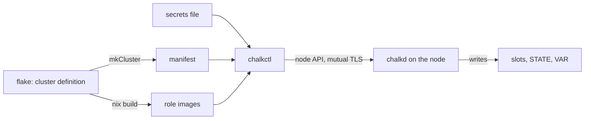

# chalkos in five minutes

A chalkos cluster is built from a Nix flake into one disk image per role, installed onto
machines that run a node agent instead of logins, and upgraded by replacing the whole image.
Each section below ends with the concept page that explains its part; the
[glossary](../reference/glossary.md) defines the terms.

The flowchart shows how the parts connect, from the flake to a running node.

## A cluster is a flake

The [cluster definition](../reference/glossary.md#cluster-definition) is a set of Nix modules
that set `chalkos.*` options: the cluster's name and API endpoint, its roles, its platforms and
its nodes. `chalkos.lib.mkCluster` evaluates them, and the [flake](../reference/glossary.md#flake)
exposes the result as `chalkos.<cluster>`. Part of that result is the
[manifest](../reference/glossary.md#manifest), a JSON document that chalkctl reads with
`nix eval`, so the flake is the only inventory of the cluster.
See [The cluster definition](../concepts/cluster-definition.md).

## Roles become images, nodes get identities

A [role](../reference/glossary.md#role), such as `controlplane` or `worker`, is a kind of node
with its own NixOS modules. Nix builds one [image](../reference/glossary.md#image) per role and
[platform](../reference/glossary.md#platform) (`metal` or `kvm`), and every node of that role
and platform boots the same image. What differs between nodes is their
[identity](../reference/glossary.md#identity): hostname, network, labels, taints, storage and
time servers, without secrets. chalkctl delivers it at install, and chalkd applies it at every
boot. See [The image](../concepts/image.md).

## The secrets file stays with the operator

`chalkctl gen secrets` writes every secret of a cluster once into the
[secrets file](../reference/glossary.md#secrets-file): the [OS CA](../reference/glossary.md#os-ca)
that the node API trusts, the [node CA](../reference/glossary.md#node-ca), the Kubernetes CAs
and keys, and the secret that [recovery keys](../reference/glossary.md#recovery-key) derive from.
It is `secrets.age`, encrypted with age, and images carry only its public part. People who
operate nodes without the whole file get a [client file](../reference/glossary.md#client-file),
a certificate of the [client role](../reference/glossary.md#client-role) reader, operator or
admin. See [Security model](../concepts/security.md).

## A node starts in maintenance mode

A machine booted from the [installer](../reference/glossary.md#installer), or a disk written
with a role image, comes up in [maintenance mode](../reference/glossary.md#maintenance-mode):
chalkd serves a self-signed certificate and prints its fingerprint and the node's addresses on
the console. `chalkctl install` checks that fingerprint and sends the node its identity, its
certificates and its share of the secrets, plus the image when the node runs the installer.
chalkd partitions the disk, seals [STATE](../reference/glossary.md#state) to the [TPM](../reference/glossary.md#tpm), marks the
node installed and reboots it into [normal mode](../reference/glossary.md#normal-mode). See
[Architecture](../concepts/architecture.md).

## The disk holds two slots and encrypted state

A system disk holds the [ESP](../reference/glossary.md#esp), two
[slots](../reference/glossary.md#slot) for the read-only [store](../reference/glossary.md#store),
STATE with the node's identity and certificates, and [VAR](../reference/glossary.md#var) for
everything the node writes, such as etcd, containerd and logs. By default STATE and VAR are
LUKS2 volumes whose keys the TPM unseals only under the same [Secure Boot](../reference/glossary.md#secure-boot) state. See
[Storage and encryption](../concepts/storage.md).

## One bootstrap, then nodes join on their own

`chalkctl bootstrap` starts etcd and the API server on the first
[control plane](../reference/glossary.md#control-plane), once in the life of a cluster. Every
other node joins without a command: further control planes add themselves to etcd, and
[workers](../reference/glossary.md#worker) register with the kubelet certificate that install
gave them. When the cluster declares a [VIP](../reference/glossary.md#vip) for the API server,
chalkd holds it on one healthy control plane. See
[Kubernetes on chalkos](../concepts/kubernetes.md) and [Networking](../concepts/networking.md).

## chalkd is the only way in

Nodes have no SSH and no login. [chalkd](../reference/glossary.md#chalkd) serves the
[node API](../reference/api.md) on TCP port 50000 over mutual TLS and accepts only clients whose
certificate chains to the OS CA; the client's role decides which methods it may call. Status,
logs, reboots, upgrades, etcd membership and certificate rotation all go through it. See
[Architecture](../concepts/architecture.md) and [Security model](../concepts/security.md).

## Upgrades replace the whole image

`chalkctl upgrade` builds the new image of each role and streams it to chalkd, which writes it
into the inactive slot. The node reboots into it with
[boot counting](../reference/glossary.md#boot-counting): a boot that passes the
[health check](../reference/glossary.md#health-check) is
[blessed](../reference/glossary.md#blessed-boot), and an image that uses up its tries, three by
default, without one gives way to the image before. chalkctl upgrades control planes one at a
time and workers in batches, and stops at the first
[rollback](../reference/glossary.md#rollback). A Kubernetes upgrade is an image upgrade too. See
[Upgrades](../concepts/upgrades.md) and
[Boot, health and rollback](../concepts/boot-and-rollback.md).

## Certificates renew themselves, CAs rotate on command

Each node renews its [node certificate](../reference/glossary.md#node-certificate) through a
control plane, which signs it with the node CA, and control planes renew the Kubernetes leaf
certificates in place, so no certificate of a running cluster expires unattended. A CA or key
changes only when an operator runs `chalkctl rotate`, which replaces it in
[rotation](../reference/glossary.md#rotation) phases that keep every node reachable; rotating is
also how access is revoked. See [Certificates](../concepts/certificates.md).
