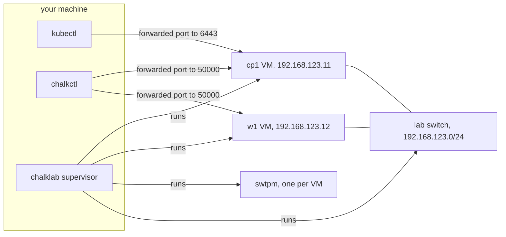

# Quick start

This tutorial builds a chalkos cluster of one control plane and one worker on your machine, runs
kubectl against it, upgrades both nodes to a new image and removes the cluster again.
[chalklab](../reference/glossary.md#chalklab) runs the two nodes as QEMU virtual machines, each
with UEFI firmware, [Secure Boot](../reference/glossary.md#secure-boot) and a
[TPM](../reference/glossary.md#tpm), so they go through the same install, bootstrap and upgrade
steps as real machines. It takes about 15 minutes; most of that is Nix downloading and
building the images the first time.

## Before you begin

You need:

- an x86-64 Linux machine with [Nix](https://nixos.org/download/) and flakes enabled;
- read and write access to `/dev/kvm`, which most distributions give to members of the `kvm`
  group;
- about 5 GiB of free memory, 3 GiB for the control plane and 2 GiB for the worker, and about
  10 GiB of free disk for the Nix store and the lab;
- git.

You do not need root. [Requirements](requirements.md#lab-host) lists the details.

## Create the cluster's flake

A chalkos cluster is a Nix flake. The `lab` template holds one that chalklab can run. Create a
directory for it and initialise the flake from the template:

```console
$ mkdir lab && cd lab
$ nix flake init -t github:trevex/chalkos#lab
wrote: "/home/alice/lab/.gitignore"
wrote: "/home/alice/lab/README.md"
wrote: "/home/alice/lab/cluster.nix"
wrote: "/home/alice/lab/flake.nix"
```

`flake.nix` pins chalkos as an input, declares the cluster `lab` with `chalkos.lib.mkCluster` and
gives a development shell. `cluster.nix` is the
[cluster definition](../reference/glossary.md#cluster-definition): two
[roles](../reference/glossary.md#role) and two [nodes](../reference/glossary.md#node) on the
`kvm` [platform](../reference/glossary.md#platform), each with a static address on a private lab
network.

```nix title="cluster.nix"
# A cluster of one control plane and one worker, which chalklab runs as QEMU virtual machines on
# this machine. Each VM has two network cards: one on the lab network, 192.168.123.0/24, between
# the VMs, which chalklab connects by the MAC address the node's network matches; and one that
# reaches the internet and the ports chalklab forwards from 127.0.0.1, configured by DHCP.
let
  labNetwork = n: {
    networks."10-lab" = {
      matchConfig.MACAddress = "52:54:00:7b:00:${n}";
      address = [ "192.168.123.${n}/24" ];
    };
  };
in
{
  chalkos.cluster = {
    name = "lab";
    # cp1 on the lab network: the API server of the only control plane.
    endpoint = "https://192.168.123.11:6443";
    # The public part of the cluster's secrets, which chalkctl gen secrets writes. The images
    # carry its OS CA.
    osCA = ./secrets.pub.json;
  };

  chalkos.roles.controlplane.kubernetes.kind = "controlplane";
  chalkos.roles.worker.kubernetes.kind = "worker";

  chalkos.nodes = {
    cp1 = {
      role = "controlplane";
      platform = "kvm";
      storage.system.disk = "/dev/vda";
      network = labNetwork "11";
    };
    w1 = {
      role = "worker";
      platform = "kvm";
      storage.system.disk = "/dev/vda";
      network = labNetwork "12";
    };
  };
}
```

Nix evaluates a flake in a git repository from the files git tracks, so put the files under git
before anything reads the flake:

```sh
git init && git add .
```

## Enter the development shell

The flake's development shell has chalklab, chalkctl and kubectl, from the chalkos version the
flake pins:

```sh
nix develop
```

The first run writes `flake.lock`, which records that version. Run every later command of this
tutorial in this shell.

## Generate the cluster's secrets

Every cluster has one [secrets file](../reference/glossary.md#secrets-file) with its CAs and
keys, written once by
[`chalkctl gen secrets`](../reference/cli/chalkctl_gen_secrets.md):

```console
$ chalkctl gen secrets --plaintext
wrote secrets.json and secrets.pub.json
warning: secrets.json holds the cluster's secrets unencrypted; protect it by other means, for example keep it out of version control with a .gitignore entry
```

`secrets.json` holds every secret of the cluster in plain text, including the
[OS CA](../reference/glossary.md#os-ca)'s key, which grants admin access to every node. The
template's `.gitignore` keeps it out of git. `secrets.pub.json` is the public part: `cluster.nix`
reads it, so the images trust the OS CA. A real cluster encrypts its secrets with age:
`--recipient` in place of `--plaintext` writes `secrets.age`, which can live in the repository.

Commit the flake, including `flake.lock`, so the lab keeps the same chalkos version:

```sh
git add . && git commit -m "A chalkos lab"
```

## Create the lab

[`chalklab create`](../reference/cli/chalklab_create.md) builds the images, starts the virtual
machines, installs both nodes and bootstraps the cluster:

```console
$ chalklab create
evaluating .#chalkos."lab"
building the kvm image of controlplane
...
building the kvm image of worker
...
creating the lab's Secure Boot keys in /home/alice/.local/state/chalklab/lab/keys
starting cp1, w1
waiting for cp1 to come up in maintenance mode
cp1 runs in maintenance mode with the certificate fingerprint 2db1ac1f7dd6f1088bb5588971225627d90013fbe2c11bc0b8e9713f0b1d8bb1
installing cp1 in place
cp1 is installed and reboots
chalkctl recovery-key cp1 prints the key that unlocks it when its TPM fails
waiting for w1 to come up in maintenance mode
w1 runs in maintenance mode with the certificate fingerprint a0e81810401c142fd8e3780865ed0b01dd17364283643ec1f11d8f9d5b0b9c0d
installing w1 in place
w1 is installed and reboots
chalkctl recovery-key w1 prints the key that unlocks it when its TPM fails
waiting for cp1 to wait for its bootstrap
cp1: kubernetes controlplane: waiting for bootstrap or for the cluster at https://192.168.123.11:6443
bootstrapping cp1; the control plane pulls its images and starts
cp1 is bootstrapped; applied 19 objects
wrote /home/alice/.local/state/chalklab/lab/kubeconfig; its certificate is valid for 8760h0m0s
wrote /home/alice/.local/state/chalklab/lab/chalkctl.json for chalklab with the admin role; its certificate expires on 2027-10-10

the lab of lab runs cp1, w1; next:
  export KUBECONFIG=/home/alice/.local/state/chalklab/lab/kubeconfig
  kubectl get nodes
  chalkctl status cp1 --config /home/alice/.local/state/chalklab/lab/chalkctl.json
  chalklab status
  chalklab destroy
```

The output follows the life of a node:

1. Nix builds one [image](../reference/glossary.md#image) per role for the `kvm` platform. Both
   nodes of a role would boot the same image; what differs between them travels separately as
   their [identity](../reference/glossary.md#identity).
2. chalklab creates Secure Boot keys for this lab, enrolls them in the firmware of the virtual
   machines and signs copies of the images with them.
3. Each virtual machine boots its image in
   [maintenance mode](../reference/glossary.md#maintenance-mode), where
   [chalkd](../reference/glossary.md#chalkd) prints its certificate's fingerprint on the console.
   chalklab reads it there and runs [`chalkctl install`](../reference/cli/chalkctl_install.md)
   with `--fingerprint`, so chalkctl talks only to that chalkd. The install creates the node's
   encrypted [STATE](../reference/glossary.md#state) and [VAR](../reference/glossary.md#var)
   partitions, sealed to its TPM, writes its identity and certificates and reboots it.
4. After the reboot, cp1 waits to be bootstrapped. chalklab runs
   [`chalkctl bootstrap`](../reference/cli/chalkctl_bootstrap.md), which starts etcd and the
   control plane; the worker joins on its own.
5. Last, chalklab writes a kubeconfig and an admin [client file](../reference/glossary.md#client-file)
   for chalkctl.

The lab keeps its state, disks, keys and logs in `~/.local/state/chalklab/lab`. A supervisor
process keeps the virtual machines running after the command returns.

Each virtual machine has two network cards. One is on the lab network, a switch that connects
only the virtual machines, with the static addresses `cluster.nix` gives them. The other is
QEMU's user-mode network, which reaches the internet and carries ports that chalklab forwards
from `127.0.0.1` on your machine: each node's chalkd and cp1's API server. The diagram shows the
layout.



## Use the cluster with kubectl

The kubeconfig reaches the API server through its forwarded port. Point kubectl at it and list
the nodes:

```console
$ export KUBECONFIG=~/.local/state/chalklab/lab/kubeconfig
$ kubectl get nodes
NAME   STATUS   ROLES    AGE   VERSION
cp1    Ready    <none>   28s   v1.37.1
w1     Ready    <none>   28s   v1.37.1
```

The nodes may show `NotReady` for the first minute, until flannel, the network plugin, runs on
them. The control plane runs as static pods that chalkd writes, next to the add-ons the bootstrap
applied:

```console
$ kubectl get pods -A
NAMESPACE      NAME                          READY   STATUS    RESTARTS   AGE
kube-flannel   kube-flannel-ds-56wr8         1/1     Running   0          2m9s
kube-flannel   kube-flannel-ds-s6wb6         1/1     Running   0          2m9s
kube-system    coredns-559f6c778d-6592l      1/1     Running   0          2m9s
kube-system    coredns-559f6c778d-gx5sw      1/1     Running   0          2m9s
kube-system    etcd-cp1                      1/1     Running   0          2m12s
kube-system    kube-apiserver-cp1            1/1     Running   0          2m18s
kube-system    kube-controller-manager-cp1   1/1     Running   0          2m12s
kube-system    kube-proxy-99fgz              1/1     Running   0          2m9s
kube-system    kube-proxy-pq4kt              1/1     Running   0          2m9s
kube-system    kube-scheduler-cp1            1/1     Running   0          2m19s
```

## Look at a node with chalkctl

The nodes have no SSH and no login. chalkctl talks to chalkd on each node over mutual TLS
instead, with the client file chalklab wrote.
[`chalkctl status`](../reference/cli/chalkctl_status.md) shows what a node runs:

```console
$ chalkctl status cp1 --config ~/.local/state/chalklab/lab/chalkctl.json
identity c894bf1180c4721d13955b4ea32f206591af2b882aff5ad3926f7995c732222a (the cluster definition's)
platform kvm (the cluster definition's)
image 0.1.0, booted from chalkos_0.1.0.efi
VOLUME  DISK    MOUNT POINT  STATE
var     system  /var         mounted
kubernetes controlplane: bootstrapped, node ready: True, control plane current
certificates:
  node                      expires 2027-10-10
  OS CA                     expires 2036-10-07
  node CA                   expires 2031-10-09
  Kubernetes CA             expires 2036-10-07
  front-proxy CA            expires 2036-10-07
  etcd CA                   expires 2036-10-07
  Kubernetes control plane  expires 2027-10-10
  kubelet client            expires 2027-10-10
  kubelet serving           expires 2027-10-10
trust:
  OS CA                 6c801dfa460f3c12
  Kubernetes CA         03169729fc14b177 (issues)
  front-proxy CA        aa6bf678236985fc (issues)
  etcd CA               cfa2b3cf6ce8bd2c (issues)
  service-account keys  f8dc2d5f576177e6 (issues)
  encryption keys       2eca90c86582dd14 (issues)
time: synchronised to 192.53.103.103, offset +0.000642 s
```

The first lines say that the node runs the identity the cluster definition gives it and image
version 0.1.0. The certificates section lists the node's certificates and CAs with their expiry
dates; the control plane renews the node's certificates before they expire. The trust section
lists the CAs and keys the node trusts by the start of their fingerprints; `(issues)` marks the
one the control plane signs with, which matters during a rotation, when two are trusted.

[`chalklab status`](../reference/cli/chalklab_status.md) shows the lab itself: the virtual
machines, their forwarded ports and the lab's files.

```console
$ chalklab status
lab of lab in /home/alice/.local/state/chalklab/lab; its supervisor runs as PID 1540233
NODE  ROLE          VM       CHALKD           API SERVER       CONSOLE
cp1   controlplane  running  127.0.0.1:46353  127.0.0.1:43323  /home/alice/.local/state/chalklab/lab/cp1/console.log
w1    worker        running  127.0.0.1:44069  -                /home/alice/.local/state/chalklab/lab/w1/console.log
kubeconfig: /home/alice/.local/state/chalklab/lab/kubeconfig
client file: /home/alice/.local/state/chalklab/lab/chalkctl.json
Secure Boot db key: /home/alice/.local/state/chalklab/lab/keys/db.key
Secure Boot db certificate: /home/alice/.local/state/chalklab/lab/keys/db.crt
```

The serial console of a node is where its firmware, kernel and chalkd write.
[`chalklab console`](../reference/cli/chalklab_console.md) prints it and follows it until you
press Ctrl+C. On cp1 it shows chalkd in maintenance mode, the install, and chalkd in normal
mode after the reboot:

```console
$ chalklab console cp1
...
[    7.325509] chalkd[537]: chalkd: maintenance mode, accepting clients of the OS CA; certificate fingerprint 2db1ac1f7dd6f1088bb5588971225627d90013fbe2c11bc0b8e9713f0b1d8bb1
...
[    7.398444] chalkd[537]: chalkd: installing in place
...
[   19.241571] chalkd[537]: chalkd: installed; rebooting
...
[    8.046725] chalkd[544]: chalkd: normal mode; certificate fingerprint c2855a14ec45b6ae2f5fb5bf66f5c480067b6e1484bb84b71e43278b65b6674b
[    8.048971] chalkd[544]: chalkd: addresses 10.0.2.15 192.168.123.11; certificate fingerprint c2855a14ec45b6ae2f5fb5bf66f5c480067b6e1484bb84b71e43278b65b6674b
...
[   33.495178] chalkd[544]: chalkd: kubernetes: applied 19 objects
```

## Upgrade the cluster

A node changes its software only by booting a new image. An
[upgrade](../reference/glossary.md#upgrade) writes the new image into the node's inactive
[slot](../reference/glossary.md#slot) and reboots into it; if the new image does not become
healthy, the node falls back to the image it ran before.

A new image needs a new version, set with NixOS's `system.image.version` in a role's
`nixosModules`. Edit `cluster.nix` so both roles build version 0.2.0, and turn on
[`chalkos.debug.tools`](../reference/options.md#chalkosdebugtools) in the same module, which adds
the tools `kubectl debug` uses on a node:

```diff
@@ -9,6 +9,10 @@ let
       address = [ "192.168.123.${n}/24" ];
     };
   };
+  upgrade = {
+    system.image.version = "0.2.0";
+    chalkos.debug.tools = true;
+  };
 in
 {
   chalkos.cluster = {
@@ -23,6 +27,10 @@ in
   chalkos.roles.controlplane.kubernetes.kind = "controlplane";
   chalkos.roles.worker.kubernetes.kind = "worker";
 
+  # A new image version for both roles, with the tools for kubectl debug.
+  chalkos.roles.controlplane.nixosModules = [ upgrade ];
+  chalkos.roles.worker.nixosModules = [ upgrade ];
+
   chalkos.nodes = {
     cp1 = {
       role = "controlplane";
```

Commit the change:

```sh
git commit -am "Upgrade to 0.2.0"
```

[`chalkctl upgrade`](../reference/cli/chalkctl_upgrade.md) builds each role's new image, signs
it and rolls it through the cluster, one node at a time. The lab's firmware boots only images
signed with the lab's Secure Boot key, so pass the key and certificate that `chalklab status`
listed:

```console
$ chalkctl upgrade --config ~/.local/state/chalklab/lab/chalkctl.json \
  --sign-key ~/.local/state/chalklab/lab/keys/db.key \
  --sign-cert ~/.local/state/chalklab/lab/keys/db.crt \
  --allow-downtime
...
upgrading controlplane on kvm to chalkos 0.2.0: cp1
upgrading worker on kvm to chalkos 0.2.0: w1
cp1: installing 0.2.0
cp1: installed 0.2.0, which boots next as chalkos_0.2.0+3.efi
cp1: cordoned, evicted 0 pods, kept 6
cp1: rebooting into 0.2.0
cp1: runs 0.2.0, found healthy
cp1: uncordoned
w1: cordoned, evicted 2 pods, kept 2
w1: installing 0.2.0
w1: installed 0.2.0, which boots next as chalkos_0.2.0+3.efi
w1: rebooting into 0.2.0
w1: runs 0.2.0, found healthy
w1: uncordoned
upgraded 2 nodes to 0.2.0
```

The lines before `upgrading` are Nix building the images. `--allow-downtime` is needed because
the lab has a single control plane: while cp1 reboots, etcd has no quorum and the API server is
down, and chalkctl refuses that unless told to accept it. In a cluster of three control planes,
the other two keep etcd and the API server running while one reboots.

Each node goes through the same steps. chalkctl sends the image to chalkd, which writes it into
the inactive slot and adds a boot entry with three tries, `chalkos_0.2.0+3.efi`. The node is
drained and reboots into the new image with
[boot counting](../reference/glossary.md#boot-counting). Once its
[health check](../reference/glossary.md#health-check) passes, the boot is
[blessed](../reference/glossary.md#blessed-boot), which removes the counter, and chalkctl
uncordons the node. A node whose new image is not found healthy within its three tries boots the
image before again, and chalkctl stops there and shows what the failed boot logged.

## Check that it worked

`chalkctl status` shows that w1 booted version 0.2.0 from the blessed entry, which has lost its
`+3`:

```console
$ chalkctl status w1 --config ~/.local/state/chalklab/lab/chalkctl.json
identity 2621ced5cd0f62cdf1aa80dc85098b8f7e3250c8fa0f18dd646657c3021319c8 (the cluster definition's)
platform kvm (the cluster definition's)
image 0.2.0, booted from chalkos_0.2.0.efi
VOLUME  DISK    MOUNT POINT  STATE
var     system  /var         mounted
kubernetes worker: joined, node ready: True
certificates:
  node             expires 2027-10-10
  OS CA            expires 2036-10-07
  Kubernetes CA    expires 2036-10-07
  kubelet client   expires 2027-10-10
  kubelet serving  expires 2027-10-10
trust:
  OS CA          6c801dfa460f3c12
  Kubernetes CA  03169729fc14b177
time: synchronised to 192.53.103.104, offset -0.000000 s
```

Both nodes are `Ready` in Kubernetes again:

```console
$ kubectl get nodes
NAME   STATUS   ROLES    AGE    VERSION
cp1    Ready    <none>   6m2s   v1.37.1
w1     Ready    <none>   6m2s   v1.37.1
```

The new image has the debugging tools, so a privileged pod can read the node's files.
`kubectl debug` runs one on w1 and prints the node's os-release, whose `IMAGE_VERSION` is the
version the image was built with:

```console
$ kubectl debug node/w1 -i --image=busybox -- chroot /host /run/current-system/sw/bin/cat /etc/os-release
Creating debugging pod node-debugger-w1-lw2hn with container debugger on node w1.
...
CHALKOS_BOOT_TRIES=3
CHALKOS_CLUSTER=lab
CHALKOS_PLATFORM=kvm
CHALKOS_ROLE=worker
...
IMAGE_ID=chalkos
IMAGE_VERSION="0.2.0"
...
```

## Remove the lab

[`chalklab destroy`](../reference/cli/chalklab_destroy.md) stops the virtual machines and removes
the lab's state, including its disks and keys:

```console
$ chalklab destroy
removed the lab in /home/alice/.local/state/chalklab/lab
```

The flake stays, so `chalklab create` builds the same cluster again. A lab you keep stays on
disk across a reboot of your machine, but its virtual machines do not start by themselves;
[`chalklab start`](../reference/cli/chalklab_start.md) starts them again with their disks, TPM
state and ports.

## What next

- [chalkos in five minutes](five-minutes.md) puts what this tutorial showed into one model.
- [Architecture](../concepts/architecture.md) explains the parts and how a node is installed.
- [Upgrades](../concepts/upgrades.md) explains slots, boot counting and rollback, and
  [Upgrade a cluster](../guides/upgrade-cluster.md) upgrades a real one.
- [Install on bare metal](../guides/install-bare-metal.md) installs chalkos on hardware.
