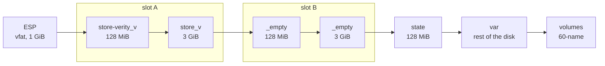

# Image and partition layout

This page lists the partitions of a node's disks, the files on the [ESP](glossary.md#esp) and on
[STATE](glossary.md#state), the outputs of an image build and the paths a running node uses. The
system region comes from `modules/node/base/disk.nix`, VAR and volumes from
`modules/cluster/storage.nix`, and the file names from `pkg/upgrade`, `pkg/install`,
`pkg/storage` and `pkg/chalkd`. [The image](../concepts/image.md) and
[Storage and encryption](../concepts/storage.md) explain why the layout is what it is.

## Partition map

The system disk holds the system region (the ESP, two [slots](glossary.md#slot) and STATE)
followed by [VAR](glossary.md#var) and the [volumes](glossary.md#volume) placed on it. A slot
is a pair of partitions: the [dm-verity](glossary.md#dm-verity) hash tree first, then the erofs
data of the [store](glossary.md#store).



The table lists the partitions in disk order. The first column is the systemd-repart
definition file that describes each one. The system region's sizes are the defaults of the
`chalkos.disk` options of the role image, and fixed, so every node of a role has the same
system region.

| Definition | Label | Size | File system | Encryption | Created by |
| --- | --- | --- | --- | --- | --- |
| `00-esp` | `esp` | [`espSize`](options.md#chalkosdiskespsize), `1G` | vfat | none | image build |
| `10-store-verity-a` | `store-verity_<version>` | [`storeVeritySize`](options.md#chalkosdiskstoreveritysize), `128M` | dm-verity hash tree | none | image build |
| `20-store-a` | `store_<version>` | [`storeSize`](options.md#chalkosdiskstoresize), `3G` | erofs, zstd | none | image build |
| `30-store-verity-b` | `_empty` | `storeVeritySize`, `128M` | none until an upgrade | none | first boot, or install from the installer |
| `40-store-b` | `_empty` | `storeSize`, `3G` | none until an upgrade | none | first boot, or install from the installer |
| `50-state` | `state` | [`stateSize`](options.md#chalkosdiskstatesize), `128M` | ext4 | node's policy, LUKS2 sealed to the [TPM](glossary.md#tpm) by default | first boot, install |
| `50-var` | `var` | [`var.size`](options.md#chalkosnodesstoragevarsize), rest of the disk | ext4 | node's policy | install |
| `60-<name>` | `<name>` | the volume's `size` | the volume's `format` | node's policy | install, later identity |

A volume with a disk of its own is the only partition on that disk, from the definition
`10-<name>`. The system region's definitions are the same files the image ships in
`/etc/chalkos/repart.d`; VAR's and the volumes' come from the node's
[identity](glossary.md#identity) and are kept on STATE.

The "Created by" column names the first writer of each partition:

- Image build: the Nix build of the role image runs systemd-repart and writes the ESP and slot A
  into the raw image.
- First boot: systemd-repart in the initrd runs the system region's definitions against the
  disk systemd-boot was loaded from, so it adds slot B and STATE behind the partitions the image
  shipped with. It runs at every boot and changes nothing once they exist.
- Install: from the [installer](glossary.md#installer), [chalkd](glossary.md#chalkd) lays out the whole system region
  on the target disk with one systemd-repart run of the role's definitions and writes slot A
  itself. In place, chalkd recreates STATE when its contents do not match the node's encryption
  policy (an unencrypted STATE for `mode = "none"`). In both flows it then creates VAR and the
  volumes.
- Identity: [`chalkctl apply-identity`](cli/chalkctl_apply-identity.md) creates volumes added
  to a node's storage and grows those whose size grew. At every boot, `chalkos-storage` in the
  initrd applies the storage section recorded on STATE again.

The sizes have lower bounds, checked when the image is evaluated: the ESP needs at least 260
MiB, the smallest ESP systemd-repart formats as vfat, and STATE at least 64 MiB, the smallest
encrypted ext4 partition it makes. The image build fails when the store's data takes more than
80% of a slot, its hash tree more than 80% of the verity partition, or three UKIs more than 80%
of the ESP. The installer sets `storeSize` and `storeVeritySize` to
null, which sizes its single slot to its contents, and its ESP to 260 MiB.

## GPT partition types

systemd-repart matches existing partitions to definitions by GPT type, so STATE, VAR and each
volume have a type of their own, a hash of the label, and no definition takes over another
one's partition.

| Partition | GPT type |
| --- | --- |
| ESP | `c12a7328-f81f-11d2-ba4b-00a0c93ec93b` |
| Store hash tree, x86-64 | `77ff5f63-e7b6-4633-acf4-1565b864c0e6` |
| Store data, x86-64 | `8484680c-9521-48c6-9c11-b0720656f69e` |
| Store hash tree, arm64 | `6e11a4e7-fbca-4ded-b9e9-e1a512bb664e` |
| Store data, arm64 | `b0e01050-ee5f-4390-949a-9101b17104e9` |
| STATE | `480b7842-1236-1abb-0339-e5503b43122a` |
| VAR | `65f335d7-a1f7-f6df-b954-a97d9a5db9e6` |
| Volume `<name>` | the first 128 bits of SHA-256 of `chalkos-partition-type:<name>`, as a UUID |

The store's types are the Discoverable Partitions Specification's `usr` types. STATE, VAR and
volumes have chalkos's own types.

## Partition UUIDs

The [UKI](glossary.md#uki)'s kernel command line carries the store's
[root hash](glossary.md#root-hash) as `usrhash=`, and systemd finds the store's partitions by
UUIDs derived from it: the data partition's UUID is the root hash's first 128 bits, the hash
tree's its last 128 bits. A store
built with the root hash `2ece03b0fa094b775ee5bf2e1f6f9eb66d6f0dc06f30f49f2f978f00e1173942`
therefore lives in these partitions:

| Partition | Label | Partition UUID |
| --- | --- | --- |
| Store data | `store_0.1.0` | `2ece03b0-fa09-4b77-5ee5-bf2e1f6f9eb6` |
| Store hash tree | `store-verity_0.1.0` | `6d6f0dc0-6f30-f49f-2f97-8f00e1173942` |

The other UUIDs are set as follows:

| Partition | Partition UUID |
| --- | --- |
| A slot being written | random, with both labels `_empty`, so nothing boots it |
| A written slot | derived from the root hash, with the labels naming the version |
| ESP | random, set at install, because systemd-boot reports it as the boot partition and no other disk with the same image may match it |
| STATE | random, from systemd-repart's `--seed=random`, when an install from the installer lays out the disk or an install recreates STATE for another encryption; otherwise the one systemd-repart gave it at first boot |
| VAR and volumes | derived by systemd-repart from a seed per cluster, node and disk name |

The labels name a slot's version but nothing boots by label; the boot finds the store by
partition UUID alone. A version is therefore limited to 23 characters of `a-z`, `0-9`, `.`, `~`,
`^` and `-`, so `store-verity_<version>` fits a GPT label of 36 characters.

## Files on the ESP

The ESP is mounted at `/efi` when it is used, with mode `0700`, and unmounted after a minute
idle, so a power cut rarely finds its FAT file system in use.

| Path | What it is |
| --- | --- |
| `/EFI/BOOT/BOOTX64.EFI` | systemd-boot, at the removable-media path, so firmware finds it without a boot entry. `BOOTAA64.EFI` on arm64. |
| `/EFI/Linux/chalkos_<version>.efi` | A UKI without a boot counter: the one the image or an install wrote, or one whose boot was [blessed](glossary.md#blessed-boot). |
| `/EFI/Linux/chalkos_<version>+<left>.efi` | A UKI an [upgrade](glossary.md#upgrade) installed, with [`chalkos.upgrade.bootTries`](options.md#chalkosupgradeboottries) tries left, such as `chalkos_0.2.0+3.efi`. |
| `/EFI/Linux/chalkos_<version>+<left>-<done>.efi` | The same UKI after systemd-boot counted a boot that was not blessed, such as `chalkos_0.2.0+2-1.efi`. `+0-3` means no tries left: systemd-boot boots another entry. |
| `/EFI/Linux/.upgrade-<version>.efi` | A UKI an upgrade is receiving. systemd-boot ignores names starting with a dot. |
| `/EFI/Linux/.install-<version>.efi` | A UKI an install from the installer is receiving. |
| `/EFI/BOOT/.boot-loader.tmp` | The boot loader an install from the installer is writing. |

`chalkos` is the image ID, `system.image.id`; the installer's UKI is
`chalkos-installer_<version>.efi`. An upgrade first removes every UKI of the image's ID except
the one the node booted and those booting the running store, then receives the new one, so the
ESP holds the UKIs of both slots and, during an upgrade, a third. UKIs of other image IDs, such
as a rescue system's, stay. An upgrade leaves systemd-boot alone: only an install writes the
boot loader.

After an upgrade, chalkd sets the EFI variable `LoaderEntryPreferred` to the new entry's ID,
`chalkos_<version>.efi` in lower case, because systemd-boot otherwise boots the newest version,
which after a downgrade is not the new image. An install from the installer adds a UEFI boot
entry labelled `chalkos` for the target ESP's removable-media path, `\EFI\BOOT\BOOTX64.EFI` on
x86-64 and `\EFI\BOOT\BOOTAA64.EFI` on arm64.

## Files on STATE

STATE is mounted at `/state`. It holds what makes the node this node and nothing else. The
`chalkd` and `kubernetes` directories are readable by root alone.

| Path | Written by | What it holds |
| --- | --- | --- |
| `identity.json` | install, ApplyIdentity | The node's identity as delivered. |
| `chalkd/node.pem` | install, renewal | The [node certificate](glossary.md#node-certificate)'s chain and its key in one file, so both are replaced together. |
| `chalkd/ca.crt` | install, [rotation](glossary.md#rotation) | The certificates of the [OS CAs](glossary.md#os-ca) the node trusts, a bundle. |
| `kubernetes/share.json` | install, rotation | The node's [Kubernetes share](glossary.md#kubernetes-share). |
| `kubernetes/node-ip` | chalkd | A [control plane](glossary.md#control-plane)'s addresses, pinned when it became an [etcd member](glossary.md#etcd-member), one per line. |
| `kubernetes/joining` | chalkd | The node started joining the cluster, so it never bootstraps a cluster of its own. |
| `kubernetes/bootstrapped` | Bootstrap | The node bootstrapped the cluster. |
| `kubernetes/etcd-initialised` | chalkd | etcd answered ready after the bootstrap, so its data exists. |
| `kubernetes/etcd-initial-cluster` | chalkd | etcd's initial cluster when the node joined an existing one. |
| `kubernetes/left` | EtcdLeave | The node left etcd; it joins again only once reinstalled. |
| `storage/storage.json` | install, ApplyIdentity | The node's storage section. |
| `storage/disks.json` | chalkos-storage, chalkd | The disks the section's names were pinned to, and the PARTUUID of each volume. |
| `storage/disks/<disk>/*.conf` | chalkos-storage, chalkd | The repart definitions of each disk, from the storage section. |
| `installed` | install | The marker that the node is installed, written last. |

A node whose STATE has no `installed` marker starts chalkd in
[maintenance mode](glossary.md#maintenance-mode).

## Outputs of an image build

`nix build .#chalkos.<cluster>.roles.<role>.images.<platform>` makes a directory of three
entries:

| Entry | What it is |
| --- | --- |
| `chalkos_<version>.raw` | The raw disk image: the ESP and slot A, with no slot B and no STATE. |
| `repart-output.json` | systemd-repart's description of the raw image's partitions: type, label, UUID, offset, size and the store's root hash. `chalkctl sign` and `chalkctl install` find the partitions with it. |
| `repart.d` | The system region's definitions, `00-esp.conf` to `50-state.conf`, as the image carries them in `/etc/chalkos/repart.d`. |

The definitions of a role with the default sizes read:

```ini title="repart.d/50-state.conf"
[Partition]
Encrypt=tpm2
Format=ext4
Label=state
SizeMaxBytes=128M
SizeMinBytes=128M
Type=480b7842-1236-1abb-0339-e5503b43122a
```

The installer's directory holds `chalkos-installer_<version>.raw` and its `repart-output.json`,
the hybrid ISO `chalkos-installer_<version>.iso`, and `chalkos-installer_<version>.iso.json`,
which describes the ISO's partitions as `repart-output.json` does.

## Device links

udev rules in the image name the disk systemd-boot was loaded from, so the node never mistakes
another disk carrying the same image or the same labels for its own.

| Link | Target |
| --- | --- |
| `/dev/disk/chalk-boot-disk` | The boot disk. |
| `/dev/disk/chalk-boot/<label>` | A partition of the boot disk by its GPT label, such as `/dev/disk/chalk-boot/esp`, `/dev/disk/chalk-boot/state` or `/dev/disk/chalk-boot/var`. |

## Paths on a running node

| Path | What it holds |
| --- | --- |
| `/efi` | The ESP, mounted on use. |
| `/state` | STATE. |
| `/var` | VAR; tmpfs until the node is installed. |
| `/etc/chalkos/repart.d` | The system region's definitions. |
| `/etc/chalkos/os-ca.crt` | The OS CA certificate the image carries, when the cluster sets [`chalkos.cluster.osCA`](options.md#chalkosclusterosca). |
| `/etc/chalkos/kubernetes/cluster.json` | The cluster's Kubernetes settings, on images of a role with a Kubernetes kind. |
| `/run/chalkos/node.json` | The node's identity as units read it. |
| `/run/chalkos/credentials/<key>` | One file per identity key a unit reads. |
| `/run/chalkos/storage-status.json` | What the last storage setup found on each disk. |
| `/run/chalkos/chrony/identity.sources` | The time servers of the identity, for chrony. |
| `/run/chalkos/kubernetes/manifests` | The static pods chalkd renders on a control plane. |
| `/run/chalkos/kubernetes/pki` | The control plane's certificates and kubeconfigs. |
| `/run/chalkos/kubernetes/kubelet` | The kubelet's `kubeconfig`, `flags` and `ca.crt`. |
| `/run/chalkos/kubernetes/node-ip` | The addresses the node picked this boot, the primary family's first. |
| `/run/chalkos/kubernetes/vxlan` | The addresses and source ranges the firewall's VXLAN rule accepts. |
| `/var/lib/etcd` | etcd's data on a control plane. |
| `/var/lib/kubelet/pki` | The kubelet's client and serving certificates. |
| `/var/lib/chalkd/failed-boot` | The log lines of the last boot that was not found healthy. |
